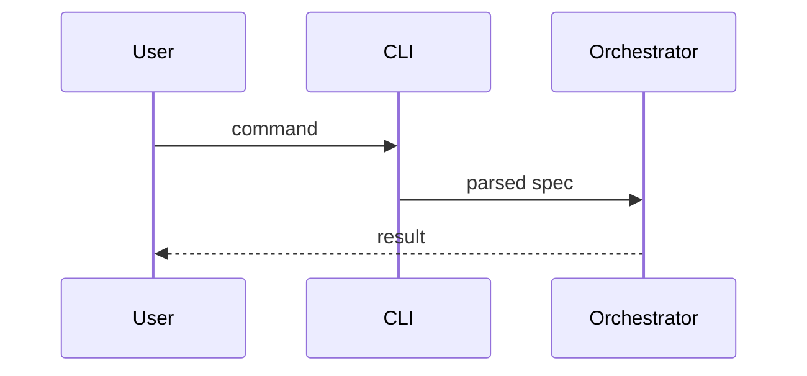
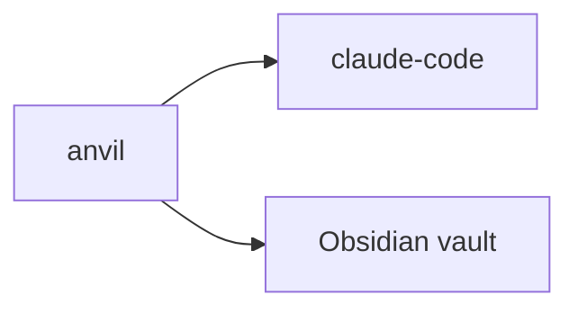

# Writing System Design — Phase procedure

Loaded on demand from `writing-system-design/SKILL.md`. Each phase has an explicit user gate — don't skip them. Phases 1, 4, and 7 are load-bearing. State the target only: no "today" statements.

### Phase 1 — Frame (LOAD-BEARING)

- Confirm the slug from the existing product-design.
- Read `~/anvil-vault/05-projects/{slug}/product-design.md`. **If it doesn't exist, stop.** Hand off to `writing-product-design`.
- Confirm destination path: `~/anvil-vault/05-projects/{slug}/system-design.md`.

**Gate (load-bearing):** product-design exists and is read.

### Phase 2 — Context and scope

Draft `## TL;DR` (the shape in one or two sentences: "X is a three-layer system: skills, orchestrator, vault."), `## Context and scope` (what the system is, who and what it talks to), and `## Non-goals` (what this design deliberately excludes).

**Gate:** user confirms the shape and the non-goals.

### Phase 3 — Constraints and quality goals

Draft `## Constraints and quality goals`: language, framework, storage, deployment, plus quality bars (latency, privacy, cost). Tech choices are constraints; there is no Tech stack section. Link a decision for each non-trivial choice.

Record an unmade choice with `anvil create decision`, or mark it `TODO: decide`.

**Gate:** user confirms each constraint.

### Phase 4 — Components (LOAD-BEARING)

Draft `## Components` as a table: component, responsibility, component-design link.

- 3-8 components (more is a smell; fold related responsibilities).
- Every product-design need maps to at least one component. The candidate-to-component map lives in the product design's Milestones list, not here.
- Link a component design (`writing-component-design`) only if the component has an interface others build against, state or invariants beyond this design's, or spans more than one milestone. Write it when the milestone building it starts.

**Gate (load-bearing):** no product-design need is orphaned.

### Phase 5 — Runtime flow

Draft `## Runtime flow` with a **mermaid sequence diagram** of the critical path. Show the target flow only. Mark each step `shipped` or `target`.

(Replace with the project's actual flow — do not ship the placeholder.)

**Gate:** user confirms the diagram captures the critical path.

### Phase 6 — Boundaries

Add a **mermaid context diagram** to `## Context and scope`: every external system the project talks to (CLIs, databases, file locations, hooks).

(Replace with the project's actual boundaries.)

**Gate:** user confirms no boundary is missing.

### Phase 7 — System invariants (LOAD-BEARING)

Draft `## System invariants`: 3-7 statements that must always be true. Planning checks against them; review verifies them.

- One level only. A system invariant is cross-component. Link a component rule; never copy it.
- Declarative and absolute. "We try to..." is not an invariant.

Examples:
- "Each agent CLI subprocess gets an isolated `CLAUDE_CONFIG_DIR` / `CODEX_HOME`."
- "Telemetry is local-only without explicit opt-in."

**Gate (load-bearing):** user signs off on each. If the user shrugs, strip it.

### Phase 8 — Decisions

Draft `## Decisions`: wikilinks to decisions that authorized the choices above, and fill frontmatter `authorized_by` with the same links. Create a missing one with `anvil create decision`. Unresolved links are acceptable: flag them `TODO: record via anvil create decision`.

**Gate:** list confirmed, or TODO list accepted.

### Phase 9 — Solution strategy and open questions

Draft `## Open questions`: unresolved items, each with an owner or the decision that would close it.

Optionally draft `## Solution strategy`: 10 lines or fewer, plus decision links. Cross-reference the product-design and decisions; don't restate.

**Voice check.** Audit for hedging, abstract framing, corporate-speak. Cite the user's own words where possible.

**Gate:** user reads cold; voice matches the project.

### Phase 10 — Risks (optional)

Draft `## Risks` only if load-bearing assumptions could fail. 3-7 bullets, each naming what could go wrong and what would signal it.

**Gate:** list confirmed, or section skipped.

### Phase 11 — Serialize & save

1. Flip frontmatter `status: draft` → `active`. Bump `updated` to today.
2. Hand-check against `schemas/system-design.schema.json`:
   - Required frontmatter: `type, title, description, created, status, project`.
   - Optional frontmatter: `updated, tags, aliases, product_design, authorized_by, related`.
   - **No other frontmatter fields** — schema is `additionalProperties: false`.
   - Body has these sections in order: TL;DR / Context and scope / Non-goals / Constraints and quality goals / Components / Runtime flow / System invariants / Decisions / Open questions. Optional Solution strategy and Risks follow.
   - No Tech stack section; no "today" statements.
   - Mermaid diagrams render (paste-test in Obsidian).
   - Wikilinks under `authorized_by` are well-formed `[[decision.{project}.NNNN-{slug}]]`.
3. Run `anvil validate <path>` — must pass clean.
4. Write to `~/anvil-vault/05-projects/{project}/system-design.md`.

**Gate:** user reads the artifact cold. If anything's off, fix and re-show.
