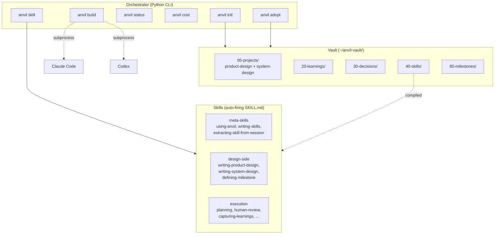
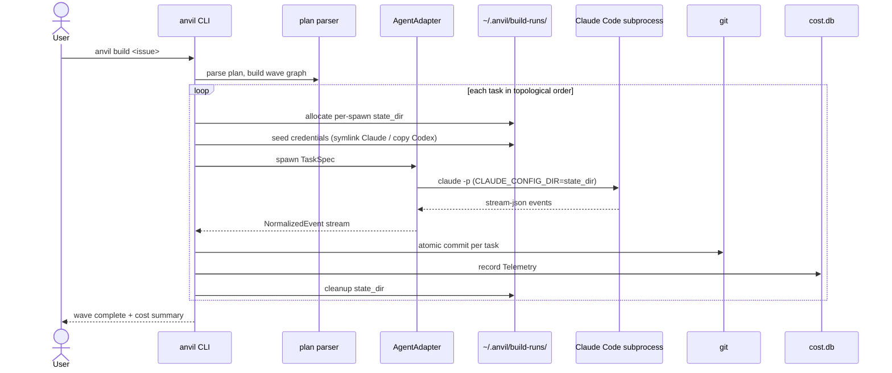
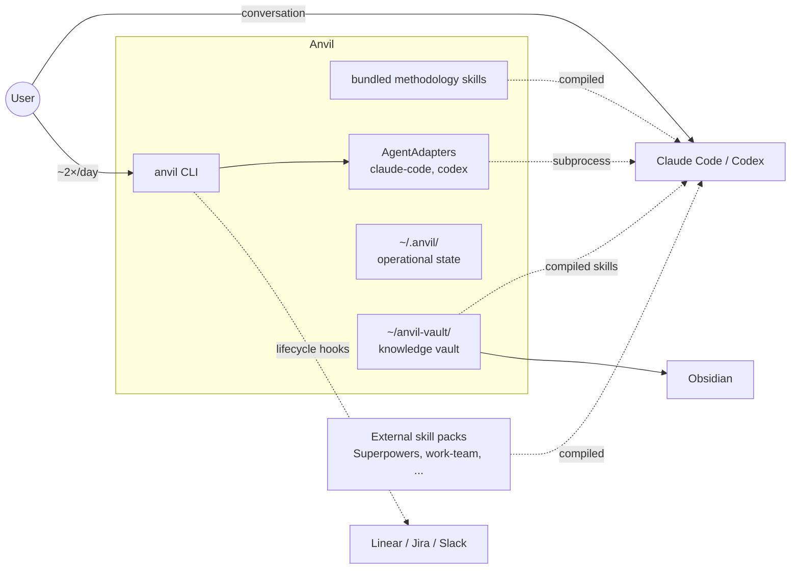

# Anvil: System Design

A craft-first methodology for AI-assisted development, packaged as auto-loading skills with a thin Python orchestrator.

This document captures the design rationale for Anvil. It exists so that future-me (and anyone else working on this) can understand *why* decisions were made, not just what they were. The design emerged from extended discussion synthesizing experience with mantle (the predecessor project), survey of existing tools (GSD, Superpowers, Spec Kit, BMAD, Agent OS, Kiro, OpenSpec, Tessl, others), and first-principles thinking about where AI-assisted development genuinely creates value vs. where it creates ceremony.

---

## Contents

**Foundations**
- [Vision and scope](#vision-and-scope) — pointer to `product-design.md` (vision, target users, success, milestones)
- [Core beliefs](#core-beliefs) — load-bearing convictions about how Anvil is built
- [Components and responsibilities](#components-and-responsibilities) — three layers (skills, orchestrator, vault) with a component diagram
- [Storage tiers](#storage-tiers) — operational state vs knowledge vault
- [Workflows](#workflows) — project bootstrap (greenfield + brownfield) and normal feature workflow
- [Data flow](#data-flow) — `anvil build` wave execution sequence
- [Boundaries and integration points](#boundaries-and-integration-points) — seams to agent CLIs, hooks, Obsidian, external skill packs

**Repository and design hierarchy**
- [Repository structure](#repository-structure) — the Anvil package, operational state, knowledge vault, compiled outputs, project repos
- [The design-driven hierarchy](#the-design-driven-hierarchy) — product-design → milestones → plans → sweeps → issues → inbox

**Vault details**
- [Vault frontmatter schemas](#vault-frontmatter-schemas) — pointer to `vault-schemas.md`; the two architectural rules stay here
- [Tag taxonomy](#tag-taxonomy) — four-facet classification, status not in tags
- [Maps of Content (MOCs) and dashboards](#maps-of-content-mocs-and-dashboards) — hybrid pattern, Bases over Dataview
- [Retention and compaction](#retention-and-compaction) — three-layer model, 50-note backpressure
- [Pitfalls in long-running AI-augmented vaults](#pitfalls-in-long-running-ai-augmented-vaults) — twelve documented failure modes with mitigations

**Orchestrator**
- [Build command](#build-command) — subprocess strategy, AgentAdapter ABC, per-spawn isolation, sequential v0.1
- [What lives in CLAUDE.md / AGENTS.md](#what-lives-in-claudemd--agentsmd) — small, hand-edited, project-specific
- [Cost management](#cost-management) — model profiles, telemetry, subscription billing audit

**Multi-agent and skills**
- [Multi-agent](#multi-agent) — Claude Code first, Codex second, others on demand
- [Skill management](#skill-management) — sources, packs, recommended companions
- [Skill authoring conventions](#skill-authoring-conventions) — workflow vs knowledge split; full rules in [`skill-authoring.md`](skill-authoring.md)

**Project planning and meta**
- [Why this shape](#why-this-shape) — the rationale threaded across the choices above
- [Versioning (deferred)](#versioning-deferred) — git is the version control story
- [What gets ported from mantle](#what-gets-ported-from-mantle) — and what doesn't
- [Implementation sequence](#implementation-sequence) — v0.1 through v0.4+
- [Anvil-specific risks](#anvil-specific-risks) — twelve ranked risks with mitigations
- [A note on tone](#a-note-on-tone) — skill voice as a design dimension
- [Closing](#closing) — final shape

---

## Vision and scope

For Anvil's vision, target users, success metrics, scope, and milestones, see [`product-design.md`](product-design.md).

---

## Core beliefs

These are the load-bearing convictions about *how* Anvil is built. Every design decision should be checkable against them. The product-side beliefs (what we're building, who it's for, what success looks like) live in [`product-design.md`](product-design.md).

1. **Workflow lives in skills the agent navigates; the orchestrator is small.** Most engineering activities (brainstorming, planning, debugging, reviewing) are skills the agent can fire from conversational triggers. They don't need CLI commands.

2. **One source of truth (markdown) compiles to many agents.** The SKILL.md open standard is the substrate. Multi-agent support falls out for free.

3. **Subprocess to the configured agent CLI is the only invocation path.** It inherits agent CLI tool harnesses and respects subscription billing — Anvil holds no API keys. If a need for direct provider access surfaces later, it's a deliberate scope expansion, not a free pickup.

4. **Don't reimplement the harness.** Tools like pi-mono build their own agent loops on raw provider SDKs. The cost is high (months of work), the benefit is narrow for a workflow methodology, and you lose subscription billing entirely. Stay above the harness.

5. **Skill metadata makes the lifecycle inspectable.** The packaging is uniform: meta-skills produce skills as their artifact, metadata tracks provenance and confidence, and refresh paths exist for both workflow and knowledge skills. (The product-side framing — "skills are hypotheses validated by use" — lives in `product-design.md`.)

---

## Components and responsibilities

Three layers, each doing one thing well: skills carry the methodology, the orchestrator does only what skills can't, and the vault accumulates personal expertise that travels across projects.



### 1. Skills (the methodology)

Auto-firing SKILL.md files following the Anthropic open standard. Compiled to the supported agents (`~/.claude/skills/`, `~/.codex/skills/`, plus `~/.agents/skills/` as a portable fallback).

Skills come from three sources, all installed into the same global directories:

- **Anvil's methodology skills** — shipped with Anvil, updated via `anvil update`. The opinionated core: planning, human-review, systematic-debugging, learning-shaping, capturing-learnings, and others.
- **External skill packs** — installed via `anvil skill add <source>`. Superpowers, work team skills, anything with a SKILL.md repo.
- **Personal vault skills** — your own accumulated expertise in `~/vault/skills/`, treated as just another source.

Skills auto-fire from conversational triggers (description-field matching). The user never types a command to invoke one — the agent recognizes the situation and loads the skill.

Conflict resolution: Anvil's skills win over external ones. Among externals, last-installed wins with rename option. User can manually pin with `anvil skill prefer <source> <name>`.

### 2. Orchestrator (the CLI)

A small Python CLI for what skills can't do — operations that require subprocess management, persistent state across sessions, or filesystem manipulation that an in-conversation skill can't perform.

Five commands. Maybe six. That's it.

```
anvil init                      scaffold .anvil/, install skills, set up hooks
anvil build [issue]             subprocess wave execution with fresh context per task
anvil status                    current state, briefing, what's next
anvil cost                      telemetry: today, by-model, by-stage, cache stats
anvil skill                     manage skill sources (add/update/remove/list)
anvil adopt                     brownfield codebase analysis (optional)
```

Anvil never holds business logic in commands that could be skills. If an activity can be expressed as auto-firing markdown, it's a skill. The CLI's existence is justified only by what *requires* a CLI: subprocess orchestration, file system operations during init, persistent state, telemetry collection.

### 3. Vault (the personal knowledge layer)

A folder of curated knowledge artifacts — learnings, decisions, sweeps, threads, skills — that travels with the user across projects. Browsed in Obsidian. Version-controlled at the vault level via git.

The vault is structurally separated from operational state (issue files, briefings, build cache, telemetry). Operational state lives in `~/.anvil/`; the vault lives in `~/anvil-vault/`. The split is deliberate: operational state churns constantly and isn't meant for human browsing; the vault is curated knowledge that accumulates slowly and rewards graph view, search, and tag exploration. See the Repository structure section for the full split.

The vault is treated as a regular skill source — `anvil skill add ~/anvil-vault` registers it alongside Superpowers, work skills, etc. The vault's `40-skills/` directory compiles into the global agent skill directories.

---

## Storage tiers

Two top-level locations under `$HOME`, each with a clear purpose. No mixing.

- **Operational state** (`~/.anvil/`) — issue files, briefings, build caches, telemetry, skill source clones, project-keyed state. Churns per-command. Not opened in Obsidian. Local to the machine; can be backed up to a private git remote but doesn't need to be.
- **Knowledge vault** (`~/anvil-vault/`) — learnings, decisions, sweeps, threads, skills, MOCs, dashboards. Accumulates slowly. Opened in Obsidian. Git-versioned at the vault level; pushed to your own remote.

Within projects, no `.anvil/` directory ships in the repo by default. Project state is keyed by git remote URL and stored under `~/.anvil/projects/<n>/`. This is the work-friendly mode (no ceremony in repos that aren't yours to modify) and is the default. Users who explicitly want project state co-located with code can opt in, but it's not the recommended path.

Compiled skills are emitted to the agent CLIs' own homes (`~/.claude/skills/`, `~/.codex/skills/`, etc.). These are build artifacts, not state. The user never edits them directly.

---

## Workflows

Workflows aren't CLI commands — they're activities the agent recognizes and dispatches via skills. The user describes what they want; the right skill fires.

### Project bootstrap workflow (greenfield)

```
idea → research → product-design → system-design → milestones → first plan
```

- **Idea**: free-form conversation with the agent about what to build. No skill required; this is just talking.
- **Research** (optional): the agent uses web tools to investigate the domain, prior art, technical feasibility. Outputs go to `~/.anvil/projects/<n>/research/` for reference.
- **Product design**: `writing-product-design` skill walks the user through what and why. Produces `~/anvil-vault/05-projects/<n>/product-design.md` with target users, problem statement, success metrics, and an initial milestone roadmap.
- **System design**: `writing-system-design` skill covers how. Produces `~/anvil-vault/05-projects/<n>/system-design.md` referencing the product design. Each meaningful architectural choice becomes a `decision` artifact, captured via `decision-making`.
- **Milestones**: `defining-milestone` skill produces individual milestone artifacts in `~/anvil-vault/85-milestones/`. Fires from inside `writing-product-design` (during the roadmap conversation) and standalone (when adding a new milestone later).
- **First plan**: `planning` skill produces a plan that targets the first milestones, sized for current attention. The plan references milestones, not the other way around.

After this, normal feature workflow takes over. The bootstrap is a one-time activity per project; the artifacts it produces are read frequently afterward.

### Project bootstrap workflow (brownfield)

```
anvil adopt → drafted product-design → drafted system-design → user refines → milestones drawn from existing structure
```

`anvil adopt` is the only orchestrator command that creates vault content directly. It reads the existing codebase, identifies the architectural shape, and proposes drafts of `product-design.md` and `system-design.md` based on what's already there. The user reviews, refines, and approves. Milestones are extracted from existing major features and gaps the user wants to address. From there, normal feature workflow.

### Normal feature workflow

```
inbox → issue → plan → build → review → archive
```

- **Inbox**: `capturing-inbox` skill fires on fleeting thoughts, queues them.
- **Issue**: `creating-issue` skill turns inbox items or fresh requests into issue files with frontmatter. The skill asks which milestone the issue serves; if no milestone fits, the skill offers to create a new one (via `defining-milestone`) or flags that the work may be out of scope.
- **Plan**: `planning` skill (formerly shape + plan; merged because they're the same activity at different resolutions) produces a plan with locked decisions, task breakdown, and verification steps. References the milestone(s) the plan serves.
- **Build**: `anvil build <issue>` runs wave execution via subprocess. Tasks execute in parallel where possible, sequential where dependent. Each task gets a fresh context window. Atomic commits per task.
- **Review**: `human-review` skill walks acceptance criteria with the user. Pass/fail per criterion. Issues flagged become follow-ups.
- **Archive**: hook fires on review-approved. Issue moves to archive, external tracker (Linear/Jira/Slack) updates via lifecycle hook script. Milestone status auto-updates if all its issues are done.

Simplicity isn't a separate phase. It's a hard rule baked into the planning and execution skills (no helpers without second use, no abstraction without need, no defensive code for unreachable states, no comments explaining what). If bloat sneaks through, review surfaces it and the user requests revision.

### Bug workflow

```
bug report → systematic-debugging → fix → learning capture
```

No issue tracking ceremony for small bugs. The `systematic-debugging` skill drives triage, root-cause analysis, and resolution. Fixes commit directly. Learnings flow to the vault. For larger bugs that warrant tracking, the skill offers to convert to an issue.

### Educational gate workflow

For issues marked `gate: learning`, the `learning-shaping` skill replaces normal planning. The agent doesn't write implementation code; it pair-programs with the user.

Loop:
1. Probe starting knowledge.
2. Generate a learning plan (concepts, reading suggestions, what the user should be able to explain when done).
3. Pair-programming loop — skill names goals, user writes code, skill reviews and questions.
4. Mid-flight check-ins — detect shallow understanding, branch into experiments or readings if needed.
5. Engineered aha moments — set up the user to *see* concepts (e.g., write the test that proves the race condition exists).
6. Gate-release ceremony — structured questions to lock in understanding before closing.
7. Vault entry with mastery tracking — concepts, applied sites, candidate future sites, mastery level.

Gate flagging happens at design time:
- Manually by the user.
- Suggested by the system (heuristics: first-time primitives in the codebase, load-bearing areas like auth/money/data integrity).
- Informed by vault (concepts not yet at `apply` mastery level get gate suggestions).

Always skippable. Skipping is logged but never punished. The next time a related concept appears, the gate may re-offer.

### Other workflows

All implemented as skills, all auto-firing:

- **Refactor** (`refactoring`) — distinct from features (no new capability, focus on quality). Maps before-state, names invariants, plans small commits with passing tests at each step.
- **Exploration** (`exploration`) — time-boxed, scratch-space, gitignored by default, with explicit promotion path to issue if findings warrant.
- **Re-entry** (`re-entry`) — reconstructs context after a break. Reads state, recent commits, open issues. Surfaces only what's needed for next-hour productivity, not a full dump.
- **Pause** (`pausing-work`) — bookend pair with re-entry. Captures mental state, dangling experiments, resume notes.
- **Decision** (`decision-making`) — surfaces actual tension, maps criteria, stress-tests choice, produces ADR.
- **Sweep** (`sweep`) — cross-cutting concerns (security, accessibility, performance). Scope, checklist, codebase walk, triage findings to inline fixes or follow-up issues.
- **Upgrade** (`upgrades`) — dependency and version maintenance. Categorizes by urgency, reads changelogs, runs test suite as source of truth.

Approximately 15 skills cover essentially every recurring engineering activity. The user never types a command for any of them.

---

## Data flow

The orchestrator's only critical path is `anvil build <issue>` — wave execution via subprocess to the configured agent CLI. The sequence below captures the canonical run shape; the [Build command](#build-command) section below covers the mechanics in full.



Per-spawn state isolation is visible at every step: each task gets its own `state_dir` under `~/.anvil/build-runs/<run-id>/<task-id>/`, with credentials seeded once and the directory torn down after the task commits. This is the same pattern that scales to concurrent waves in v0.2; v0.1 just runs the loop sequentially.

---

## Boundaries and integration points

Anvil sits between the user and the agent CLIs, with several explicit seams to systems it doesn't own. The context diagram below shows what's inside the boundary and what isn't.



The seams worth naming explicitly:

- **Operational state vs knowledge vault.** `~/.anvil/` (per-command churn, machine-local) and `~/anvil-vault/` (slow accumulation, git-versioned, browsed in Obsidian) never mix. See [Storage tiers](#storage-tiers) for the split.
- **Agent CLI boundary.** Anvil subprocesses to Claude Code or Codex for all coding work — this is the only invocation path. Per-spawn state isolation lives at this seam (`CLAUDE_CONFIG_DIR` / `CODEX_HOME`). The agent CLIs themselves are not Anvil; Anvil never reimplements their tool harness, prompt-injection defenses, or permission UX, and never reaches around them to provider APIs directly. See [Build command](#build-command).
- **Skill source boundary.** Three skill source classes (bundled methodology, external packs, vault skills) all compile into the agent CLI's home directory (`~/.claude/skills/`, `~/.codex/skills/`). Conflict resolution and pack toggling live in the orchestrator; the agent CLI just reads its skills directory. See [Skill management](#skill-management).
- **Lifecycle hook boundary.** Anvil never imports tracker libraries or holds credentials. Lifecycle events fire user-supplied scripts under `~/.anvil/projects/<n>/hooks/` with positional arguments and `hooks_env` passthrough; the script itself talks to Linear / Jira / Slack / whatever. See [Hooks](#hooks).
- **Vault → Obsidian boundary.** The vault is a folder of markdown with frontmatter. Obsidian is one consumer (the human-facing one); the agent CLI is another (it reads compiled SKILL.md files). The vault survives plugin churn and tooling changes because it's plain text with a small schema set. See [Vault frontmatter schemas](#vault-frontmatter-schemas).

The pattern across every seam: Anvil owns the *normalization* (the adapter, the manifest, the schema, the hook contract) and never owns the *external surface* (the agent CLI's harness, the tracker's API, Obsidian's plugins). Adapters absorb the divergence; the orchestrator stays small.

---

## Repository structure

Three distinct concerns, each in its own location. They exist independently and can be developed at different speeds.

### The Anvil repo (Python package)

This is the orchestrator and the canonical methodology skills. Published to PyPI as `anvil` (or whichever name lands). Skills live at the top level of the repo so the package itself is also a valid skill source — anyone can `anvil skill add github:yourname/anvil` and pull just the skills without installing the Python package.

```
anvil/
├── pyproject.toml
├── README.md
├── CHANGELOG.md
├── LICENSE
├── docs/
│   ├── design.md                    this document
│   ├── getting-started.md
│   ├── multi-agent.md
│   ├── cost-management.md
│   └── writing-skills.md
├── skills/                          canonical methodology skills (top-level)
│   ├── using-anvil/
│   │   └── SKILL.md
│   ├── writing-skills/
│   │   └── SKILL.md
│   ├── extracting-skill-from-session/
│   │   └── SKILL.md
│   ├── researching-domain/
│   │   └── SKILL.md
│   ├── synthesizing-knowledge-skill/
│   │   └── SKILL.md
│   ├── writing-product-design/
│   │   └── SKILL.md
│   ├── writing-system-design/
│   │   └── SKILL.md
│   ├── defining-milestone/
│   │   └── SKILL.md
│   ├── capturing-inbox/
│   │   └── SKILL.md
│   ├── creating-issue/
│   │   └── SKILL.md
│   ├── planning/
│   │   └── SKILL.md
│   ├── human-review/
│   │   └── SKILL.md
│   ├── learning-shaping/
│   │   └── SKILL.md
│   ├── capturing-learnings/
│   │   └── SKILL.md
│   ├── re-entry/
│   │   └── SKILL.md
│   ├── pausing-work/
│   │   └── SKILL.md
│   ├── decision-making/
│   │   └── SKILL.md
│   └── sweep/
│       └── SKILL.md
├── schemas/                         JSON Schemas for vault artifact types
│   ├── product-design.schema.json
│   ├── system-design.schema.json
│   ├── milestone.schema.json
│   ├── learning.schema.json
│   ├── decision.schema.json
│   ├── skill.schema.json
│   ├── sweep.schema.json
│   ├── thread.schema.json
│   ├── issue.schema.json
│   └── plan.schema.json
├── src/anvil/
│   ├── __init__.py
│   ├── cli/
│   │   ├── __init__.py
│   │   ├── main.py                  Typer entry point
│   │   ├── init.py                  anvil init
│   │   ├── build.py                 anvil build
│   │   ├── status.py                anvil status
│   │   ├── cost.py                  anvil cost
│   │   ├── skill.py                 anvil skill add/update/remove/list
│   │   └── adopt.py                 anvil adopt
│   ├── core/
│   │   ├── __init__.py
│   │   ├── state.py                 ~/.anvil/projects/<n>/state.md read/write
│   │   ├── briefing.py              compile session briefing
│   │   ├── issues.py                issue file parsing, frontmatter
│   │   ├── plans.py                 plan file parsing, wave graph
│   │   ├── hooks.py                 lifecycle hook invocation
│   │   ├── config.py                config.toml loading
│   │   ├── manifest.py              skill-sources.toml management
│   │   ├── project_resolver.py      git remote → ~/.anvil/projects/<n>/ lookup
│   │   └── validation.py            JSON Schema validation for vault artifacts
│   ├── adapters/
│   │   ├── __init__.py
│   │   ├── base.py                  AgentAdapter ABC, NormalizedEvent, Telemetry, TaskSpec, TaskResult
│   │   ├── claude_code.py           v0.1
│   │   └── codex.py                 v0.2
│   ├── telemetry/
│   │   ├── __init__.py
│   │   ├── db.py                    SQLite schema and access
│   │   ├── otel.py                  OpenTelemetry GenAI emitters
│   │   └── parsers/
│   │       ├── claude.py            parse ~/.claude/projects/*.jsonl (vendored ccusage logic)
│   │       └── codex.py             parse codex JSONL rollouts (@ccusage/codex)
│   ├── templates/                   files generated by anvil init
│   │   ├── AGENTS.md.j2
│   │   ├── CLAUDE.md.j2             generated mirror of AGENTS.md
│   │   ├── vault/
│   │   │   ├── README.md.j2
│   │   │   ├── obsidian.config.json
│   │   │   ├── tag-conventions.md
│   │   │   └── starter-mocs/
│   │   │       ├── _home.md.j2
│   │   │       ├── projects.md.j2
│   │   │       └── dashboards/
│   │   │           ├── active-issues.base
│   │   │           ├── recent-learnings.base
│   │   │           └── decisions-by-project.base
│   │   ├── project/
│   │   │   ├── config.toml.j2
│   │   │   └── state.md.j2
│   │   └── hooks/
│   │       ├── on-issue-shaped.example.sh
│   │       ├── on-issue-implement-start.example.sh
│   │       ├── on-issue-verify-done.example.sh
│   │       └── on-issue-review-approved.example.sh
│   └── installer/
│       ├── __init__.py
│       └── compile.py               compile skills to .claude/, .codex/, etc.
└── tests/
    ├── adapters/
    ├── cli/
    ├── core/
    ├── skills/                      golden-output behavioral tests
    └── conftest.py
```

The 17 bundled skills are the canonical Anvil-shaped methodology. Each is a directory with at minimum a `SKILL.md`, optionally with `references/`, `scripts/`, or `assets/` subdirectories per the Anthropic open standard. Skills break the flat-file rule deliberately — the spec requires per-skill folders.

The bundled skills carry the workflow burden, divided into three sides: **meta** (skills that produce other skills), **design** (produce structural artifacts), and **execution** (produce operational artifacts that reference them). Each skill is also typed as **workflow** (multi-phase process body) or **knowledge** (principles + patterns body).

| Skill | Side | Type | Workflow it serves |
|---|---|---|---|
| `using-anvil` | meta | knowledge | explains the system on first session |
| `writing-skills` | meta | knowledge | style guide for all SKILL.md authoring |
| `extracting-skill-from-session` | meta | workflow | crystallize a working in-context workflow into a skill |
| `researching-domain` | meta | workflow | produce a first-draft knowledge skill from focused research |
| `synthesizing-knowledge-skill` | meta | workflow | refresh a knowledge skill with accumulated vault learnings |
| `writing-product-design` | design | workflow | produces `product-design.md` for a project |
| `writing-system-design` | design | workflow | produces `system-design.md` (with mermaid diagrams), references the product design |
| `defining-milestone` | design | workflow | produces individual milestone artifacts |
| `capturing-inbox` | execution | workflow | inbox capture |
| `creating-issue` | execution | workflow | inbox → issue conversion; asks which milestone the issue serves |
| `planning` | execution | workflow | shape + plan (merged); produces wave-graph mermaid in plan body; references milestones |
| `human-review` | execution | workflow | review phase |
| `learning-shaping` | execution | workflow | educational gate workflow |
| `capturing-learnings` | execution | workflow | retro / vault entry on issue close |
| `re-entry` | execution | workflow | resume after a break |
| `pausing-work` | execution | workflow | bookend pair with re-entry |
| `decision-making` | execution | workflow | structured decision → ADR |
| `sweep` | execution | workflow | cross-cutting concerns |

Design-side skills enforce ordering: `writing-system-design` won't fire until a product design exists for the project, and prompts the user to create one first if missing. This protects the *design before implementation* discipline.

Meta-skills are the methodology's reproductive system. `extracting-skill-from-session` produces workflow skills; `researching-domain` produces knowledge skills; `synthesizing-knowledge-skill` refreshes them. Each invokes `writing-skills` as a sub-skill for formatting. The methodology bootstraps itself: most of the seventeen skills can be authored via the meta-skills rather than green-field drafted.

**Generic engineering skills are not bundled.** Brainstorming, test-driven development, systematic debugging, refactoring patterns, exploration spikes, dependency upgrade workflows — these exist independent of Anvil and are well-served by Superpowers and other external packs. `anvil init` recommends installing Superpowers as a companion. See "Recommended companion packs" in the skill management section.

### Operational state (`~/.anvil/`)

Per-project and global Anvil state. Never opened in Obsidian. Mostly local to the machine.

```
~/.anvil/                            operational layer
├── config.toml                      global Anvil config (default agent, vault path, etc.)
├── skill-sources.toml               manifest of installed skill sources
├── skill-sources/                   cloned external skill repos
│   ├── anvil/                       Anvil's canonical skills (treated as a source)
│   ├── obra-superpowers/
│   ├── mattpocock-skills/
│   └── work-team-skills/
├── projects/                        per-project operational state
│   ├── payment-service/
│   │   ├── config.toml              project config (model profile, agent default, etc.)
│   │   ├── state.md                 current state, what's done, what's next
│   │   ├── briefing.md              compiled briefing (regenerated by SessionStart)
│   │   ├── issues/                  the work backlog
│   │   │   ├── index.md
│   │   │   ├── issue-1.md
│   │   │   └── issue-2.md
│   │   ├── plans/                   generated plans per issue
│   │   │   └── issue-2-plan.md
│   │   ├── threads/raw/             raw transcripts before distillation
│   │   ├── inbox/                   project-scoped fleeting captures
│   │   ├── hooks/                   user-supplied lifecycle hook scripts
│   │   ├── cache/                   incremental build cache
│   │   ├── cost.db                  project SQLite telemetry
│   │   └── .git-remote              pointer to the actual code repo
│   └── api-gateway/
│       └── ...
├── workspaces/                      cross-repo coordination
│   └── payments-platform/
│       ├── config.toml              declares member projects
│       ├── state.md
│       ├── issues/                  workspace-level issues (cross-cutting)
│       └── ...
└── cost.db                          global telemetry rollup
```

Project identity is keyed by git remote URL. When the user runs `anvil status` from inside a code repo, Anvil reads the current directory's git remote, looks up the corresponding `~/.anvil/projects/<n>/`, and operates on that state. Two checkouts of the same repo (a primary clone and a worktree) resolve to the same project state automatically.

The user can opt to `anvil link <local-path>` to register a project under a custom name if multiple repos share a remote, but this is rare.

### Knowledge vault (`~/anvil-vault/`)

The single Obsidian vault. Curated knowledge artifacts only. Git-versioned at the vault level; pushed to your own remote (private by default). Folders are numbered for sort stability and to signal lifecycle direction.

```
~/anvil-vault/
├── AGENTS.md                        entry point for any AI tool reading the vault
├── CLAUDE.md                        generated mirror of AGENTS.md
├── README.md                        human entry point; links to AGENTS.md and dashboards
├── .obsidian/                       Obsidian config (committed)
│   ├── app.json                     userIgnoreFilters for skill internals
│   ├── core-plugins.json
│   └── plugins/
├── 00-inbox/                        human capture only; AI writer never touches
├── 05-projects/                     per-project design artifacts (the load-bearing top of the chain)
│   ├── payment-service/
│   │   ├── product-design.md        what & why for this project
│   │   ├── system-design.md         how it fits together
│   │   └── README.md                links to milestones, plans, recent work
│   ├── api-gateway/
│   │   ├── product-design.md
│   │   └── system-design.md
│   └── ...
├── 10-sessions/
│   ├── raw/                         AI-generated session transcripts (status: raw)
│   └── distilled/                   sessions whose insights were promoted (kept as provenance)
├── 20-learnings/                    type/learning, flat with topic prefixes
│   ├── postgres.cic-snapshot-wait.md
│   ├── monitoring.lock-wait-alert-gap.md
│   └── ...
├── 30-decisions/                    type/decision, MADR-conformant ADRs
│   ├── auth.0007-use-jwt.md
│   └── ...
├── 40-skills/                       type/skill — user-authored knowledge skills (grows over time)
│   ├── sqlmesh-best-practices/
│   │   ├── SKILL.md                 visible in Obsidian
│   │   ├── references/              hidden by Obsidian (userIgnoreFilters)
│   │   ├── scripts/                 hidden by Obsidian
│   │   └── assets/                  hidden by Obsidian
│   └── ...
├── 50-sweeps/                       type/sweep
├── 60-threads/                      type/thread
├── 70-issues/                       type/issue (knowledge slice; ops state in ~/.anvil/)
├── 80-plans/                        type/plan
├── 85-milestones/                   type/milestone, the structural backbone
│   ├── payments.m1-capture-baseline.md
│   ├── payments.m2-idempotency.md
│   ├── auth.m3-oauth-integration.md
│   └── ...
├── 90-moc/                          static MOCs + their .base sibling files
│   ├── _home.md
│   ├── projects.md
│   ├── authentication.md
│   ├── authentication.base
│   └── dashboards/
│       ├── active-issues.base
│       ├── recent-learnings.base
│       └── decisions-by-project.base
├── 99-archive/                      cold storage; demoted sessions, deprecated decisions
├── _meta/
│   ├── tag-conventions.md           controlled vocabulary, with examples
│   ├── frontmatter-schema.md        what fields go where (links to schemas/)
│   └── retention-policy.md          how content lifecycle works
└── .gitignore
```

**Folder numbering rationale.** PARA-style numeric prefixes give sort stability across filesystems and signal lifecycle direction. `00-inbox` (capture) → `05-projects` (architectural top, read first) → `10-sessions` (raw AI output) → `20-80` (curated artifacts) → `85-milestones` (structural backbone, sits between artifacts and navigation) → `90-moc` (navigation) → `99-archive`. The numbering is deliberately PARA-flavored without claiming PARA semantics.

The `05-projects/` folder is intentionally placed near the top — it's the design-driven hierarchy's load-bearing layer. When someone opens the vault and asks "what is this project?", they should land here before anything else. The `85-milestones/` folder sits just before navigation because milestones bridge the design (above) and the operational artifacts (below).

**Filename convention.** Within each folder, files are flat with Dendron-flavored topic prefixes (`{topic}.{slug}.md`). Decisions add MADR's `nnnn-` numeric prefix (`auth.0007-use-jwt.md`). No deep nesting; topic prefixes give grouping without folder hierarchy.

**Why folder-per-type rather than tag-only classification.** Path filters are the cheapest agent query. `glob("20-learnings/*.md")` is O(1); scanning every note's frontmatter is not. The folder is the type; the `type:` frontmatter field mirrors it for machine consistency; the `type/` tag mirrors it for human navigation in Obsidian's tag pane.

**The `00-inbox/` firebreak.** Inbox is human capture only. The AI writer never touches it. This is the contamination-control pattern that prevents agent-generated noise from polluting human idea capture. The agent writes session transcripts to `10-sessions/raw/`, which is its own territory.

**Skills hide their internals from Obsidian.** `40-skills/<n>/SKILL.md` is visible; `references/`, `scripts/`, `assets/` are hidden via `.obsidian/app.json`'s `userIgnoreFilters`. The skill on disk is intact for the agent; Obsidian's search, graph, and quick-switcher only surface the SKILL.md. Configured automatically by `anvil init --vault`.

### Compiled outputs (agent home directories)

Anvil emits compiled skills and config into the agent CLIs' own homes. These are build artifacts, not state. Users never edit them directly.

```
~/.claude/skills/                    where Anvil compiles all skills
├── planning/                        from anvil/skills/
├── human-review/
├── ...
├── replay-cached-response/          from ~/anvil-vault/40-skills/
└── test-driven-development/         from ~/.anvil/skill-sources/obra-superpowers/

~/.codex/skills/                     same set, compiled for Codex
```

The compile step is run by `anvil init`, `anvil skill add`, `anvil skill update`. It walks all registered sources (Anvil itself, the vault, external packs), resolves conflicts by precedence (Anvil wins, then last-installed), and copies SKILL.md folders into each enabled agent's home.

### Project repos (no `.anvil/` by default)

Project code repos contain only the code and any agent-specific files the agent CLIs themselves require. Anvil does not require any directory in the project repo by default.

```
my-project/                          a code repo
├── (your normal project files)
├── CLAUDE.md                        optional: project-specific agent context (committed)
├── AGENTS.md                        optional: same content for non-Claude tools
├── .claude/                         optional: project-specific Claude settings
│   ├── skills/                      project-specific skills only (rare)
│   │   └── our-conventions/
│   │       └── SKILL.md
│   └── settings.json
└── .codex/                          optional, when targeting Codex
```

**These directories are optional.** The work-friendly default is no Anvil-related files in the project repo at all. Users with their own personal repos who want project state co-located with code can opt in via `anvil init --in-repo` (writes `.anvil/` into the project), but this is not the recommended path.

When the user does add `CLAUDE.md` or `AGENTS.md` to a project, those are hand-edited by the user and committed for team consistency. Anvil doesn't generate them per project — they capture project-specific conventions that the team owns.

### What's committed where

| Path | Status | Rationale |
|---|---|---|
| `~/anvil-vault/` (entire vault) | git-versioned at vault level, pushed to private remote | Personal knowledge, survives machine loss, optionally shareable |
| `~/.anvil/projects/<n>/` | local-only by default | Operational state, regenerable, machine-specific |
| `~/.anvil/projects/<n>/cache/`, `cost.db`, `briefing.md` | local-only always | Pure runtime artifacts |
| `~/.anvil/skill-sources/` | local-only | Cloned upstream repos; `anvil skill update` re-fetches |
| `~/.claude/skills/`, `~/.codex/skills/` etc. | local-only | Compiled output, regenerable |
| `<project>/CLAUDE.md`, `AGENTS.md` (when present) | committed in project repo | Hand-edited project context |
| `<project>/.claude/skills/` (when present) | committed in project repo | Project-specific skills, team-shared |

The user's vault is the only thing that needs explicit backup. Everything else is either regenerable from the vault and the Anvil package, or specific to a machine and not worth syncing.

### Hooks

Lifecycle hooks live in `~/.anvil/projects/<n>/hooks/` per project (or in `~/.anvil/hooks/` for global hooks that fire across all projects). The convention from mantle survives unchanged.

```
~/.anvil/projects/payment-service/hooks/
├── on-issue-shaped.sh                fires after planning saves the plan
├── on-issue-implement-start.sh       fires when issue transitions to implementing
├── on-issue-verify-done.sh           fires when issue transitions to verified
└── on-issue-review-approved.sh       fires when issue transitions to approved
```

Each script:
- Optional: missing scripts are silent no-ops.
- Receives `$1` (issue number), `$2` (new status), `$3` (issue title) as positional arguments.
- Inherits environment variables defined under `hooks_env:` in the project's `config.toml`.
- Non-zero exit logs a warning but never blocks the workflow.

Anvil itself never imports tracker libraries or holds credentials. Users supply their own scripts (Linear CLI calls, Jira API calls, Slack webhooks, whatever). The bundled examples in `src/anvil/templates/hooks/` show the pattern.

---

## The design-driven hierarchy

Anvil treats the project's design as the load-bearing artifact, not its issues. This is the Bezos line — *stubborn on the vision, flexible on the implementation* — applied to AI-assisted development. Everything in the system flows from the design downward:

**product-design → milestones → plans → sweeps → issues → inbox**

Read top-down, this is how a project evolves: a clear vision of what we're building and why, broken into structural milestones, executed through time-bound plans, realized via sweeps and issues, with raw thoughts captured to inbox before they're shaped into anything else.

Read bottom-up, this is provenance: every issue traces to a milestone, traces to the product design, traces to the project's purpose. The agent (and future-you) can mechanically answer "why are we doing this?" by walking the chain upward.

The architectural artifacts at the top of the chain — `product-design`, `system-design`, `milestone` — are *long-lived and structural*. They change slowly, deliberately, with revision narratives captured in the doc itself. The operational artifacts at the bottom — `plan`, `sweep`, `issue`, `inbox` — are *short-lived and tactical*. They come and go as work flows through the system.

This split matters because the design document is what someone returning to a project after weeks away should read first. It's not the issue backlog; that's noise without context. It's not the recent threads; those are mid-flight thinking. The design is the answer to "what is this project?" Everything else is downstream.

The design also resists scope creep. When someone proposes a new direction, the question is "does this serve a milestone in the product design?" If yes, it earns a place. If no, it's either a new milestone (which means revising the product design deliberately) or it doesn't belong. The design document is where ambition gets disciplined.

For brownfield projects, `anvil adopt` works backwards from the existing code to draft a product and system design, then prompts the user to validate and refine. This is the only orchestrator command that creates vault content directly — most operations write to operational state in `~/.anvil/`, not the knowledge vault. Adoption is the exception because brownfield specifically needs to bootstrap the design narrative the project never had.

The seventeen methodology skills divide cleanly into design-side (writing-product-design, writing-system-design, defining-milestone) and execution-side (planning, human-review, systematic-debugging, etc.). The design-side skills produce structural artifacts; the execution-side skills produce operational artifacts that reference them. The chain holds because every operational artifact's frontmatter must point upward — issues reference milestones, plans reference milestones and decisions, sweeps reference plans.

---

## Vault frontmatter schemas

Every vault artifact type has a concrete frontmatter schema. The full catalog — `product-design`, `system-design`, `milestone`, `learning`, `decision`, `skill`, `sweep`, `thread`, `issue`, `plan`, `transcript` / `session` — with example YAML and field rationale lives in [`vault-schemas.md`](vault-schemas.md). JSON Schemas for each type ship at `anvil/schemas/*.schema.json` and are validated in CI via `check-jsonschema`.

The two structural rules that govern every schema are architectural, so they're stated here:

1. **Obsidian Properties-compliant types only** (Text, List, Number, Checkbox, Date, Date & time). No nested objects in top-level YAML except where unavoidable (`sweep.metrics`, document `revisions`) — Obsidian's Properties UI cannot edit nested objects and several plugins choke on them.
2. **Schemas are starter shapes; CI validation is the load-bearing part.** Drift in any field across notes is the documented failure mode at scale, and schema-validated PRs prevent it. The catalog is where a new field originates; the schema files in `anvil/schemas/` are the enforcement surface.

---

## Tag taxonomy

The vault uses a four-facet faceted classification, prefixed in YAML `tags:` lists. This is borrowed from MeSH (PubMed's controlled vocabulary), defended against folksonomy alternatives that universally fail at scale due to synonym sprawl.

| Facet | Purpose | Example values |
|---|---|---|
| `domain/` | What knowledge area | `domain/postgres`, `domain/typescript`, `domain/aws`, `domain/llm`, `domain/auth`, `domain/observability` |
| `activity/` | What work mode produced it | `activity/debugging`, `activity/refactor`, `activity/design`, `activity/research`, `activity/review` |
| `pattern/` | What reusable abstraction it documents | `pattern/error-handling`, `pattern/concurrency`, `pattern/caching`, `pattern/auth`, `pattern/migration`, `pattern/idempotency` |
| `type/` | What kind of artifact (mirrors the `type:` frontmatter field) | `type/decision`, `type/learning`, `type/skill`, `type/sweep`, `type/thread`, `type/issue`, `type/plan`, `type/moc`, `type/transcript`, `type/session` |

**Status does not go in tags.** This is the most-violated rule in vaults at scale and the one whose violation hurts most. Lifecycle states mutate; renaming a tag across thousands of notes is destructive (forum reports of duplicate-tag fallout are common). Status lives in frontmatter where edits are atomic per-note and naturally typed for Bases summaries.

**Hygiene rules.** Lowercase only. ASCII only. Hyphens not underscores. No spaces (Obsidian splits frontmatter tags on space). Start tight (10–12 values per facet) and add new values only after a real second use. A monthly Bases query lists all distinct tags with `< 3` uses; promote, merge, or delete each one.

**Why a `type/` tag when `type:` already exists in frontmatter.** Redundant by design. The frontmatter field is canonical for queries; the tag mirror exists so a human scanning the rendered note in Obsidian sees the type at a glance, and so the tag pane is useful for navigation. A pre-commit hook validates that they match.

The starter taxonomy ships at `~/anvil-vault/_meta/tag-conventions.md`, written by `anvil init --vault`. The user adapts it over time; the conventions doc captures the vault's current shape. Skills writing to the vault read this doc to stay consistent.

---

## Maps of Content (MOCs) and dashboards

Two patterns at scale: hand-curated MOCs for narrative navigation, Bases queries for exhaustive indexes. Hybrid combines both.

**Manual MOCs alone fail at ~500–1,000 notes** (curation can't keep up with growth). **Pure Dataview MOCs fail at ~3,000–5,000 notes** (UI freezes; Dataview's maintainer has shifted focus to Datacore). **Bases handles 50,000-note vaults instantly** because it uses Obsidian's native metadata cache.

The hybrid pattern: a hand-written `90-moc/{area}.md` containing 5–30 carefully chosen wikilinks with paragraphs explaining *why* each note matters, followed by an embedded `.base` view for the exhaustive auto-updating index.

```markdown
# Postgres operations MOC

This hub collects everything we know about running Postgres in production.
Start with [[learning.postgres.cic-snapshot-wait]] for the canonical
gotcha; see [[decision.postgres.0004-replication-strategy]] for context
on why we run async replication.

## Curated path
- [[learning.postgres.cic-snapshot-wait]] — the lock interaction nobody warns you about
- [[decision.postgres.0004-replication-strategy]] — why async, not sync
- [[plan.postgres.q2-pgbouncer-rollout]] — current direction

## Everything in this domain
![[postgres.base]]
```

Where `90-moc/postgres.base` is:

```yaml
filters:
  and:
    - file.hasTag("domain/postgres")
    - 'status != "deprecated"'
properties:
  file.name: { displayName: Note }
  type: { displayName: Type }
  status: { displayName: Status }
  updated: { displayName: Updated }
views:
  - type: table
    name: All
    order: [file.name, type, status, updated]
    sort: [{ column: updated, direction: DESC }]
    group: type
```

**Hand-curate the narrative section** whenever an area has more than three notes. **Auto-generate the index section always** via Bases. **Never hand-curate a list of every note in a domain** — that's where MOCs die at scale.

The dashboard MOC (`90-moc/_home.md`) is the most-opened note in the vault. It uses Bases exclusively, no Dataview, because the cost of a freeze on every session-start is too high.

A note on Bases stability. Bases is in Catalyst early access as of early 2026 and has shipped breaking syntax changes once (1.9.2). The downside is contained — the underlying YAML format is plain text and survives plugin churn; worst case dashboards need re-authoring against new syntax. This is acceptable risk given the 50× performance advantage over Dataview at scale.

---

## Retention and compaction

The defining failure mode of AI-augmented vaults is write-only-vault syndrome. AI lowers the marginal cost of producing a transcript to zero; without retention policy the curated signal drowns in raw noise within weeks. Reports converge on a 200-unprocessed-note threshold beyond which retrieval starts hallucinating connections.

Three-layer retention model:

**Time-based, automatic.**
- `status: raw` older than 14 days → flagged in the daily dashboard for review.
- `status: raw` older than 30 days with no inbound links and no `triaged` transition → auto-moved to `99-archive/`, status flipped to `archived`.
- `status: archived` raw transcripts older than 180 days with zero backlinks → eligible for deletion (manual confirmation required).

**Event-based.**
- End-of-session hook writes a session log to `10-sessions/raw/` with `status: raw` and `retention_until: created + 30 days`.
- When a session produces a reusable insight, the user (or `capturing-learnings` skill) creates a `learning` or `decision` artifact in the proper folder, links back to the source session, and the session bumps to `status: distilled` and moves to `10-sessions/distilled/`.

**Count-based backpressure.** When `~/anvil-vault/10-sessions/raw/` exceeds 50 unprocessed notes, halt new auto-imports and require a triage pass. This is the load-bearing rule that prevents the documented "200 unprocessed notes turns the agent into a mess" failure mode. The 50-note threshold is conservative — adjustable via `~/.anvil/config.toml` if a user is operating at higher volume — but the mechanism (halt + require triage) is non-negotiable.

**Backpressure UX is unresolved as of v0.1 and worth thinking through carefully.** When the count exceeds 50 and the agent goes to write a session log, the desired behavior could be:
- Refuse, and surface a triage prompt before allowing further session writes.
- Auto-archive the oldest raw note to make room.
- Soft-warn but allow the write, with escalating friction.

The first option is most disciplined but creates friction at exactly the wrong moment (end of a productive session). The second is permissive but risks losing context from a session whose insights weren't yet distilled. The third is a compromise. The right answer depends on real use; v0.1 ships with option 3 (soft-warn, then escalating block at 75 and 100) and revisits after observing actual triage behavior.

**What promotes up to permanent storage.** Reusable patterns (→ `20-learnings/` with `pattern/X` tag), decisions with rationale (→ `30-decisions/`, MADR-shaped), mistakes with the fix (→ `20-learnings/`, with explicit `confidence: high`), reproducible how-tos (→ `20-learnings/` with `diataxis: how-to`).

**What gets archived but never deleted.** Distilled session logs whose insights were promoted — they remain in `10-sessions/distilled/` permanently as provenance.

**What gets deleted.** Dead-end exploratory sessions after the 14-day archive window if no backlinks accumulate. Keep the trace; lose the noise.

---

## Pitfalls in long-running AI-augmented vaults

Ranked by likelihood × severity, drawn from public reports of vaults running 6+ months with AI augmentation.

1. **Tag drift / synonym sprawl.** Universal, hits by ~6 months. Mitigation: enforce the four-facet taxonomy from day one; monthly Bases query for tags with `< 3` uses; pre-commit hook validates tag prefixes against controlled vocabulary.

2. **Frontmatter drift / inconsistency.** Universal, painful by ~2,000 notes. Same field as `created` vs `created_at` vs `date`; some notes have YAML, some don't. Mitigation: ship `schemas/*.schema.json`, run `check-jsonschema` in CI on every PR. The single most effective preventive measure.

3. **AI plugin index corruption at scale.** Hits at 5,000+ notes (Smart Connections, Copilot Vault QA). Full re-index every restart, hundreds of MB of index files, JSON serialization failures. Mitigation: don't depend on these plugins for agent reads. Agents read the filesystem directly; embedding plugins are for human exploratory search and accept that they need re-indexing.

4. **Write-only-vault syndrome.** Universal at 6+ months. Mitigation: 50-note backpressure rule; daily triage of `status: raw`; hard 14/30-day demotion timers; hybrid MOCs that surface high-signal notes vs raw transcripts.

5. **Dataview slowdowns.** Noticeable at ~1,000 notes; severe at ~4,000+; unusable at ~9,000+. Mitigation: build dashboards in Bases, not Dataview. Reserve Dataview for rarely-opened analysis pages.

6. **Manual MOC failure.** Hits at ~1,000 notes. Mitigation: hybrid pattern — narrative top, embedded Bases bottom; never hand-maintain a list of every note in a domain.

7. **Embedding-plugin frontmatter pollution.** Smart Connections embeds frontmatter as part of the note body, so notes with heavy YAML show only YAML in the connection preview. Mitigation: agents read filesystem directly and parse frontmatter; treat embedding plugins as best-effort human search only.

8. **Duplicate notes from AI generation.** AI creates a second note instead of editing existing. Mitigation: AGENTS.md instructs the agent to search before creating; periodic Bases query for duplicate titles.

9. **Internal link rot from file moves.** Mitigation: always rename within Obsidian (it updates backlinks); fall back to grep-based link validation in CI for catastrophic moves. ULID-based stable IDs are deferred — added when a real link-rot incident occurs, not preemptively.

10. **Six-month "false productivity" rebuild.** Users spend hours on themes and CSS, then rebuild from scratch when the underlying schema turns out wrong. Mitigation: schema-first design; lock the structure for at least a quarter before tweaking aesthetics.

11. **Mobile vault collapse.** Vaults with 1,000+ notes plus attachments become unusable on mobile (slow open times). Mitigation: hide attachments folder; exclude `10-sessions/raw/` from mobile sync; accept desktop-only if vault is large.

12. **Vault disappearance from cloud-sync mistakes.** iCloud, Syncthing have eaten vaults. Mitigation: vault is git-versioned at the vault level; never put `.obsidian/` inside iCloud-synced folders.

---

## Build command

The orchestrator's only real workhorse. Subprocess to the configured agent CLI; spawn one task at a time per wave (sequential in v0.1, concurrent later); collect output and telemetry; commit atomically per task.

### Why subprocess (not SDK direct)

Three reasons:

1. **Subscription billing.** Claude Code Max users want to spend sub credits on coding work. Only subprocess execution preserves this. Direct API calls bill at API rates regardless of subscription status. All target CLIs preserve subscription billing through filesystem-resident credentials (`~/.claude/.credentials.json` keychain, `~/.codex/auth.json`); none require API keys when the user is already logged into the consumer subscription.

2. **Tool harness inheritance.** Claude Code and Codex each ship sophisticated tool harnesses (file editing with diffs, sandboxed bash, web fetch, MCP integration, permission UX, prompt injection defenses). Reimplementing these is months of work for narrow benefit.

3. **Future-proof.** When Anthropic ships prompt caching v2 or new model capabilities, CLI users get them automatically. SDK reimplementations become moving targets.

Anvil never reaches around the agent CLI to a provider SDK directly. If a need for direct provider access surfaces later (auxiliary classification, pre-flight token counting, batch jobs), it's a deliberate scope expansion — invariant 2 says so explicitly.

### Adapter pattern

Each agent CLI has its own invocation surface (different flags, different output formats, different telemetry sources). Anvil normalizes via adapters with a shared interface. The adapters absorb agent-specific quirks; the orchestrator code (plan parsing, atomic commits, hook invocation, telemetry aggregation) is agent-agnostic.

The interface is the contract — load-bearing enough to spell out in full:

```python
from __future__ import annotations
from abc import ABC, abstractmethod
from dataclasses import dataclass, field
from enum import Enum
from pathlib import Path
from typing import AsyncIterator, Mapping, Optional, Sequence
import asyncio


class EventKind(str, Enum):
    SYSTEM_INIT     = "system_init"      # session_id, model, cwd, tools, plugins
    ASSISTANT_TEXT  = "assistant_text"   # incremental or whole assistant text
    REASONING       = "reasoning"        # chain-of-thought / thinking parts
    TOOL_CALL       = "tool_call"        # tool invocation (before)
    TOOL_RESULT     = "tool_result"      # tool result (after)
    PERMISSION_ASK  = "permission_ask"   # blocked awaiting approval
    USAGE_DELTA     = "usage_delta"      # incremental token usage
    RETRY           = "retry"            # non-fatal transient error
    ERROR           = "error"            # fatal stream error
    RESULT          = "result"           # final, terminal


@dataclass(frozen=True)
class NormalizedEvent:
    kind: EventKind
    session_id: Optional[str]
    timestamp_ms: int
    payload: Mapping[str, object]   # raw shape, agent-specific
    text: Optional[str] = None
    tool_name: Optional[str] = None
    tool_input: Optional[Mapping[str, object]] = None
    tool_output: Optional[str] = None


@dataclass(frozen=True)
class Telemetry:
    input_tokens: int = 0
    output_tokens: int = 0
    cache_read_tokens: int = 0
    cache_write_tokens: int = 0
    reasoning_tokens: int = 0
    cost_usd: Optional[float] = None     # None when subscription/quota-based
    model: Optional[str] = None
    api_key_source: Optional[str] = None # "oauth" | "env" | "helper" — for audit


@dataclass(frozen=True)
class TaskResult:
    success: bool
    session_id: Optional[str]
    final_text: str
    telemetry: Telemetry
    duration_ms: int
    num_turns: Optional[int] = None
    error_kind: Optional[str] = None     # "max_turns"|"max_budget"|"permission"|"timeout"|"crash"|"api"
    raw_events: Sequence[NormalizedEvent] = field(default_factory=tuple)


@dataclass(frozen=True)
class TaskSpec:
    prompt: str
    cwd: Path                            # the project directory the task runs in
    state_dir: Path                      # per-spawn isolated CLAUDE_CONFIG_DIR / CODEX_HOME
    model: Optional[str] = None
    max_turns: Optional[int] = None
    max_budget_usd: Optional[float] = None
    timeout_s: float = 600.0
    skip_permissions: bool = True        # automation mode for unattended runs
    allow_tools: Optional[Sequence[str]] = None
    deny_tools: Optional[Sequence[str]] = None
    resume_session_id: Optional[str] = None
    fork_from: Optional[str] = None
    extra_env: Mapping[str, str] = field(default_factory=dict)


class AgentAdapter(ABC):
    """One adapter instance per spawned subprocess. Stateless across spawns."""

    name: str                            # "claude-code" | "codex-cli"
    binary: str                          # absolute path to verified binary
    version: str

    # ---------- mandatory ----------
    @abstractmethod
    def build_argv(self, spec: TaskSpec) -> Sequence[str]: ...
    @abstractmethod
    def build_env(self, spec: TaskSpec) -> Mapping[str, str]: ...
    @abstractmethod
    async def stream_events(
        self, spec: TaskSpec
    ) -> AsyncIterator[NormalizedEvent]: ...
    @abstractmethod
    def collect_telemetry(
        self, events: Sequence[NormalizedEvent]
    ) -> Telemetry: ...
    @abstractmethod
    async def run(self, spec: TaskSpec) -> TaskResult: ...
    @abstractmethod
    def detect_session_id(
        self, events: Sequence[NormalizedEvent]
    ) -> Optional[str]: ...

    # ---------- optional capability flags ----------
    def supports_resume(self) -> bool: return False
    def supports_fork(self) -> bool: return False
    def supports_max_turns(self) -> bool: return False
    def supports_max_budget(self) -> bool: return False
    def supports_output_schema(self) -> bool: return False

    async def health_check(self) -> bool: return True
    async def kill_gracefully(self, proc: asyncio.subprocess.Process) -> None:
        proc.terminate()
        try: await asyncio.wait_for(proc.wait(), 5.0)
        except asyncio.TimeoutError: proc.kill()
```

The capability flags are honest about which adapters support which features. Anvil's CLI checks them before passing flags that may not be honored. For example, `--max-budget-usd` is Claude-only; passing it to Codex silently fails.

### Adapter shipping order

**v0.1 — `ClaudeCodeAdapter` only.** Subprocess to `claude -p`, parse `stream-json` NDJSON output. The terminating `result` event carries cost and usage in canonical form. Session ID exposed in `system/init` and every subsequent event. Vendor ccusage's parser for telemetry from `~/.claude/projects/*.jsonl` since the official telemetry surface and the JSONL transcript don't fully agree.

Specific Claude flags Anvil uses:
- `--output-format stream-json --verbose` for the NDJSON event stream.
- `--permission-mode bypassPermissions` (or `--dangerously-skip-permissions` equivalent) for unattended runs.
- `--allowedTools` / `--disallowedTools` with patterns like `Bash(git diff *)` or `Read(./src/**)`.
- `--max-turns` and `--max-budget-usd` as enforcement layers (with caveats below).
- Never pass `--bare`. It bypasses OAuth and would break Max subscription billing.
- Never set `ANTHROPIC_API_KEY` when subscription billing is intended; verify `apiKeySource` in `system/init` to confirm OAuth is active.

**v0.2 — `CodexAdapter`.** Subprocess to `codex exec --json`, parse v2 NDJSON events (`thread.started`, `turn.started/completed/failed`, `item.started/completed`, `error`). The event vocabulary is cleaner than Claude's nested message objects. Session ID arrives in `thread.started`; the orchestrator must parse the first event since there's no env var exposure.

Specific Codex flags Anvil uses:
- `--json` (or `--experimental-json`) for the NDJSON stream.
- `-a never` is the only safe approval policy in `exec` mode. Any escalation request silently fails otherwise.
- `--sandbox workspace-write --skip-git-repo-check` for unattended runs.
- `--cd <path>` for the working directory.
- `--profile <name>` for swappable defaults if needed.

**Beyond v0.2: additional adapters as needed.** OpenCode is excluded from the initial scope. It's a strong TUI but an awkward subprocess target — every `opencode run` boots a Bun+Hono server with multi-second cold-boot cost, the NDJSON event schema is community-documented rather than versioned, and concurrent runs corrupt SQLite at `~/.local/share/opencode/`. The recommended integration shape is `opencode serve` + SSE, which is a different deployment pattern than subprocess. If a user genuinely needs an OpenCode adapter, the right time is after v0.2 stabilizes with a real reason and likely a different integration approach. Other adapters (custom internal models, additional vendor CLIs) can be built against the same interface as need arises.

### Per-spawn state isolation

This is the single most important operational pattern, and it's a v0.1 hard requirement even with sequential execution.

Both target CLIs corrupt under shared state across runs (Claude #24864 and #17531; Codex #11435 and #1991). The fix is the same shape across both: each spawn gets its own state directory via environment variable, with credentials seeded once per directory.

| CLI | State env var | Credential seeding |
|---|---|---|
| Claude Code | `CLAUDE_CONFIG_DIR=<state_dir>` | Symlink `~/.claude/.credentials.json` into the state dir, or run `claude setup-token` once to mint a long-lived OAuth token shared across spawns |
| Codex | `CODEX_HOME=<state_dir>` | Copy `~/.codex/auth.json` into the state dir at spawn time. Codex refreshes `auth.json` in place per-spawn, which is fine since spawns don't share the file |

The state dir itself is a temp directory under `~/.anvil/build-runs/<run-id>/<task-id>/state/`, cleaned up after the spawn completes. This pattern is sequential-safe in v0.1 and trivially extends to concurrent execution in v0.2.

Additional environment hardening for both CLIs:
- `DISABLE_AUTOUPDATER=1` so a build run doesn't trigger a CLI update mid-execution.
- `stdin=DEVNULL` on `subprocess.Popen` to avoid the pre-fix Claude 2.1.x stdin-hang behavior.

### Sequential execution in v0.1

V0.1 ships with **single-task-at-a-time execution**. The orchestrator processes the wave graph in topological order but runs one task at a time, even when tasks are theoretically parallelizable.

Why sequential first:
- Per-spawn state isolation works trivially without worktree management.
- Failure modes simpler: one process to monitor, one stream to parse.
- The wave-graph machinery still earns its place — it determines task order — but parallelism is deferred.
- Mantle's wave execution worked in practice because mantle didn't hit the concurrency hazards documented in the research. Anvil starts conservative and adds parallelism with eyes open.

Concurrent waves arrive in v0.2 alongside the worktree harness:
- Each parallel task runs in its own git worktree at `~/.anvil/build-runs/<run-id>/<task-id>/repo/` to prevent file-system collisions.
- Each task gets its own state dir as already established for sequential execution.
- Default concurrency cap of 4 (well below the 8-10 range where issues #10887 and #24864 manifest), backoff on transient errors.
- Claude Code's native `--worktree` flag is preferred when available; Codex requires the orchestrator to drive `git worktree add` manually.

### Stream parsing

Each adapter has a `_translate(line: dict) -> NormalizedEvent` function mapping CLI-specific events to the normalized vocabulary. Two non-obvious parsing rules worth encoding from day one:

**Claude Code: deduplicate token usage by message ID.** Multiple `tool_use` blocks share an `assistant.message.id`, so naive summing of `usage` over per-event reports over-counts tokens. The authoritative figure is in the terminal `result` event; for incremental usage updates, dedupe by message id. ccusage handles this; Anvil's parser must too.

**Codex: distinguish retry errors from terminal errors.** `error` events with text matching `^Reconnecting` are non-fatal. Only `turn.failed` and unprefixed `error` events are terminal. Treat retries as `EventKind.RETRY`, not `EventKind.ERROR`.

| Anvil `EventKind` | Claude Code line | Codex CLI line |
|---|---|---|
| `SYSTEM_INIT` | `{"type":"system","subtype":"init",...}` | `{"type":"thread.started","thread_id":...}` |
| `ASSISTANT_TEXT` | `assistant.message.content[].type=="text"` | `item.completed` with `item.type=="agent_message"` |
| `TOOL_CALL` | `assistant.message.content[].type=="tool_use"` | `item.started` with `item.type=="command_execution" \| "mcp_tool_call" \| "file_change"` |
| `TOOL_RESULT` | `user.message.content[].type=="tool_result"` | `item.completed` matching prior `item.started` |
| `USAGE_DELTA` | per-`assistant.message.usage` (dedupe by message id) | not emitted incrementally |
| `RETRY` | `system/api_retry` | `error` with text `^Reconnecting` |
| `ERROR` | `result.subtype=="error"` | `turn.failed` or unprefixed `error` |
| `RESULT` | `result.subtype=="success"` (terminal) | `turn.completed` (last) |

### Telemetry collection

Adapters extract telemetry from the parsed event stream. Sketches per CLI:

```python
def normalize_claude(events: list[NormalizedEvent]) -> Telemetry:
    # Last RESULT carries authoritative total_cost_usd and aggregated usage.
    r = next(e for e in reversed(events) if e.kind == EventKind.RESULT)
    u = r.payload["usage"]
    return Telemetry(
        input_tokens=u["input_tokens"],
        output_tokens=u["output_tokens"],
        cache_read_tokens=u.get("cache_read_input_tokens", 0),
        cache_write_tokens=u.get("cache_creation_input_tokens", 0),
        cost_usd=r.payload.get("total_cost_usd"),  # estimate on Max subscriptions
        model=next(iter(r.payload.get("modelUsage", {})), None),
        api_key_source=events[0].payload.get("apiKeySource"),
    )

def normalize_codex(events: list[NormalizedEvent]) -> Telemetry:
    tc = next(e for e in reversed(events)
              if e.kind == EventKind.RESULT and "usage" in e.payload)
    u = tc.payload["usage"]
    return Telemetry(
        input_tokens=u["input_tokens"],
        output_tokens=u["output_tokens"],
        cache_read_tokens=u.get("cached_input_tokens", 0),
        reasoning_tokens=u.get("reasoning_tokens", 0),
        cost_usd=None,  # ChatGPT Plus is quota-based; rate_limits null in exec
        model=spec_model,
    )
```

For Max subscription users on Claude Code, `total_cost_usd` is an *estimate* — the user isn't actually charged at API rates. The `api_key_source` field lets `anvil cost` honestly report this: "X% of estimated quota, ~$Y equivalent if billed at API rates." For Codex on ChatGPT Plus, real cost isn't even visible from `exec` (issue #14728); only quota windows via app-server endpoints. Anvil reports those honestly too.

### Failure handling

The wave can fail in many ways. Anvil's `run()` method wraps event streaming in `asyncio.wait_for`, drains output on timeout, and constructs a `TaskResult` with the appropriate `error_kind`.

| Failure mode | Claude Code signature | Codex signature | Recovery |
|---|---|---|---|
| Hung subprocess (no output) | post-result hang #25629 | rare under `exec` | wall-clock SIGKILL after `timeout_s`; `error_kind="timeout"` |
| Crash mid-run | non-zero exit, no `result` event | non-zero exit, no `turn.completed` | `error_kind="crash"`; surface stderr to user |
| Permission blocked | `result.subtype="error"` with `permission_denials[]` | `-a never` returns failed action via `turn.completed` with no apply | `error_kind="permission"`; user sees what was denied |
| Quota / billing exhausted | `result.subtype="error"`, error matches "billing"/"rate_limit" | `error` event with quota text | `error_kind="api"`; pause wave, surface cost message |
| Auth lost | `apiKeySource` missing; HTTP 401 in retry chain | `auth.json` refresh failure → exit non-zero | `error_kind="api"`; prompt user to re-login |

When a task fails, the wave pauses. The orchestrator surfaces the failure with context (which task, which error_kind, last assistant text), and asks: retry, fall back to inline implementation, or abort the build. Subsequent tasks don't start until the user resolves.

### Wave execution mechanics

Plans declare task dependencies. Anvil computes a wave graph (topological sort). In v0.1, tasks execute one at a time even when theoretically parallelizable — the wave structure determines order, not parallelism.

Each task:
1. Allocates a per-spawn state directory under `~/.anvil/build-runs/<run-id>/<task-id>/`.
2. Seeds credentials into the state directory (Claude: symlink credentials file; Codex: copy auth.json).
3. Spawns the subprocess with the per-spawn `state_dir` env var, fresh context (no resumption).
4. Streams events through the adapter's `stream_events`, normalizing as it goes.
5. Loads relevant skills via the agent CLI's native discovery (Claude reads `~/.claude/skills/`, Codex reads `~/.codex/skills/` — both populated by `anvil compile`).
6. Implements the task per its spec.
7. Runs verification (tests, lint).
8. Commits atomically with a structured message including issue ID and task scope.
9. Cleans up the state directory.
10. Records telemetry to `~/.anvil/projects/<n>/cost.db`.

### Risks specific to subprocess execution

1. **Claude `--max-turns` is buggy on resume (#3286).** The flag is ignored when used with `--resume`. Anvil's v0.1 doesn't use resume (every spawn is fresh) so this isn't immediately exposed, but worth knowing if v0.2 introduces session resumption.

2. **Claude `--bare` is documented to become the default for `-p` "in a future release"** and bypasses OAuth/Keychain. Anvil must explicitly never pass `--bare` while expecting Max billing. If/when the default flips, Anvil's invocation must explicitly opt out.

3. **Codex `--full-auto` semantics changed quietly** in late 2025 from `workspace-write + on-failure` to `workspace-write + on-request`, and `on-failure` is deprecated. Anvil uses `-a never --sandbox workspace-write` explicitly rather than relying on `--full-auto` to avoid surprises.

4. **Claude Code 2.1.x sporadic post-result hang (#25629, #1920).** The `result` event sometimes precedes a hang; sometimes the `result` event is dropped entirely. Anvil's wall-clock timeout is correctness backstop, not just a politeness budget.

5. **Version pinning has security implications.** Claude Code has had ≥9 published CVEs by April 2026 including symlink and confirm-prompt bypasses. Pin a known-good tagged version of each CLI; treat upgrades as security-reviewable events. Anvil's `init` should record the CLI version and warn on upgrade drift.

6. **Auth file lifecycle for Codex.** Don't overwrite `auth.json` from a static secret on every spawn — it discards refreshed tokens. Copy once at run start; let Codex mutate it within the run's state dir; discard at run end.

---

## What lives in CLAUDE.md / AGENTS.md

The agent's always-loaded context. Everything in it pays a cache cost forever, so it has to earn its place. Target: under 150 lines, ideally under 100.

Contents (ordered by importance):

- **Project identity.** One paragraph. What it is, what it does, who uses it.
- **How we work.** Pointer to Anvil. "This project uses Anvil. Skills auto-fire from `~/.claude/skills/`. Run `anvil status` for current state. Run `anvil build <issue>` for parallel implementation."
- **Tech stack.** Load-bearing facts only. Language, framework, database, deployment target.
- **Conventions.** Naming, file organization, error handling, test style, type annotations. Two or three sentences each.
- **Commit strategy.** Style (conventional commits or local format), atomicity, message format, when to commit. Specific.
- **Simplicity rules.** No helpers without second use, no abstraction without need, no defensive code for unreachable states, no comments explaining what.
- **Forbidden patterns.** Things actively not wanted. Specific.
- **Tooling commands.** Test, lint, type-check, format. Spelled out, not implied.
- **Pointers, not contents.** Larger artifacts (system design, ADRs, domain glossary) referenced by path, loaded on demand.

`anvil init` generates a starter from a template, populates detected stack info, leaves conventions/commit strategy as TODO sections. `anvil adopt` proposes values for those sections based on codebase analysis but always confirms with the user.

---

## Cost management

Cost discipline is structural, not a dashboard.

### Architectural levers

1. **Skills load lazily.** Auto-firing means a skill's content enters context only when its description matches user intent. No always-on compiled context.

2. **Cache breakpoints around stable text.** Skills are stable; their text sits at the top of context with `cache_control: {ttl: "1h"}`. Project state changes; that sits below the cache breakpoint.

3. **Briefing rendered once per session.** SessionStart hook generates a small briefing (~2k tokens), cached. Replaces v1's per-command compiled context that paid the cost on every invocation.

4. **Model profile, not per-token tuning.** Three profiles: `quality` (Opus throughout), `balanced` (Opus planning, Sonnet execution, Sonnet verification), `budget` (Sonnet planning, Sonnet execution, Haiku verification). Users pick one and forget. GSD's pattern; it works.

### Telemetry

`.anvil/cost.db` SQLite stores every invocation with OpenTelemetry GenAI semantic conventions. Schema:

```
request_id, command_id, session_id, issue_id, git_sha,
model, model_snapshot,
input_tokens, cache_read_tokens, cache_write_5m_tokens,
cache_write_1h_tokens, output_tokens, reasoning_tokens,
cost_usd, price_table_version, tier (api|subscription|batch|local),
prompt_hash, raw_usage_json, timestamp
```

`anvil cost` surface:

- `anvil cost today` — high-level summary.
- `anvil cost build <issue-id>` — per-stage breakdown for a specific build.
- `anvil cost --by-model` — distribution across models.
- `anvil cost cache-stats` — cache hit rate by category.

For Max subscription users, dollar figures are estimated equivalents (you can't read sub usage directly). Surface this honestly: "X% of estimated quota, ~$Y equivalent if billed at API rates."

The cost surface is intentionally small. Detailed telemetry exists for debugging Anvil itself; daily users don't need it.

---

## Multi-agent

Skills are portable for free (open SKILL.md standard) — confirmed by recent CLI updates: Claude Code, Codex, and other agent CLIs all natively read SKILL.md from their respective skill directories with progressive disclosure (only YAML metadata in the system prompt; bodies lazy-loaded on demand). Installing many skills is therefore cheap, not expensive.

The orchestrator is portable behind the adapter layer for the agents we explicitly target.

`anvil init --agents claude,codex` generates `~/.claude/skills/`, `~/.codex/skills/`, `~/.agents/skills/` from the same SKILL.md sources. Per-agent quirks (Claude hooks, Codex `AGENTS.md` chain) live in small per-target adapters within Anvil's compile step.

The user switches agents by running `anvil build --agent codex <issue>` (or whichever default is set). Skills auto-fire identically across both because they're the same files in different directories.

Anvil targets two adapters in v0.x: `claude-code` and `codex-cli`. The build command section above explains why OpenCode is excluded from initial scope and what would change if it were added later. Custom internal harnesses or additional vendor CLIs can be added against the same `AgentAdapter` interface as concrete need arises.

Honest tradeoff: even the two supported CLIs differ in subtle ways. Codex doesn't expose `--max-budget-usd` or per-event token usage; Claude has the post-result hang quirk (#25629); telemetry surfaces are similar but not identical. The capability flags on `AgentAdapter` (`supports_resume`, `supports_max_budget`, etc.) are how Anvil's CLI gracefully degrades when a flag isn't honored.

---

## Skill management

External skills install via:

```bash
anvil skill add <source>           # git url, github shorthand, or local path
anvil skill update [source]        # pull latest
anvil skill remove <source>        # uninstall and clean up
anvil skill list                   # what's installed and where it came from
anvil skill prefer <source> <name> # resolve name conflict explicitly
```

`<source>` accepts:
- Git URL: `https://github.com/obra/superpowers`
- GitHub shorthand: `github:mattpocock/skills`
- Local path: `~/work/team-skills`
- Specific skill: `github:obra/superpowers#skills/test-driven-development`

Sources clone into `~/.anvil/skill-sources/<source-id>/`. Anvil walks each source for SKILL.md files and copies them into global agent skills directories. Manifest at `~/.anvil/skill-sources.toml` records what came from where.

Conflict rules:
- Anvil's methodology skills win over external skills with the same name.
- Among externals, last-installed wins with warning and rename option.
- User can manually pin with `anvil skill prefer`.

Non-standard repos: only SKILL.md-formatted skills install. Malformed folders are skipped with a clear report. No coercion.

The vault is treated as a regular source: `anvil skill add ~/vault` registers it alongside everything else. Updates flow through `anvil skill update` like any other source.

### Skill packs

Anvil treats skill sources as packs that can be enabled or disabled as a unit. The methodology pack (Anvil's bundled skills) is always enabled. The vault pack is enabled per-user. External packs (Superpowers, Pocock's skills, work-team skills) are toggleable. This mitigates the documented "20-50 simultaneous skills" concern from Anthropic's guide — when a library grows large, users can disable packs they're not actively using rather than uninstalling them.

`anvil skill pack disable <pack-name>` and `anvil skill pack enable <pack-name>` toggle a pack at the registration level. Compiled skills remain on disk but aren't symlinked into the agent CLI's skill directory.

### Recommended companion packs

Anvil's bundled methodology is deliberately scoped to skills that are *Anvil-shaped* — meta-skills, design-side skills, and execution skills that reference Anvil's artifacts (issues, plans, milestones, vault learnings) or implement Anvil-specific lifecycle (educational gating, session bookends). Generic engineering skills (TDD, debugging discipline, refactoring patterns, brainstorming) are deliberately *not* bundled. The broader skill ecosystem ships these well, and forking them into Anvil would mean maintaining duplicates of skills that are already battle-tested elsewhere.

The composable positioning beats the bundled positioning for two reasons. First, it respects what already exists — Superpowers' `brainstorming` is the result of significant iteration with documented behavioral observations driving its design; reimplementing it costs effort and produces something worse. Second, it positions Anvil correctly: a methodology that composes with the ecosystem rather than competes with it.

`anvil init` strongly recommends installing Superpowers and offers to add it as the first skill source:

```bash
$ anvil init
Anvil initialized at ~/.anvil/

Anvil's bundled methodology covers project lifecycle, design, and
session management. For generic engineering skills (TDD, debugging,
brainstorming, refactoring), we recommend Superpowers as a companion.

Add Superpowers as a skill source? [Y/n]
```

If the user accepts, the equivalent of `anvil skill add github:obra/superpowers` runs. If they decline, the recommendation lives in `anvil skill list --recommended` and in the getting-started docs so they can add it later.

When Superpowers' skills need tighter integration with Anvil-specific artifacts (e.g., wanting `systematic-debugging` to auto-capture findings to the vault), the right move is to **port the skill into Anvil's bundle deliberately**. This makes the divergence explicit, captures the integration in skill metadata (`forked_from: superpowers/systematic-debugging`), and signals to maintainers that we'll take on the maintenance burden in exchange for the integration benefit. Until that bar is met, compose rather than fork.

The conflict rules above (Anvil's methodology wins over externals with the same name) are deliberately conservative: if Anvil ever needs to ship its own version of a skill Superpowers also has, the override is automatic. But the bundle should be small enough that this rarely happens in practice.

### Aggregate description budget

Claude Code defaults to a 15,000-character `SLASH_COMMAND_TOOL_CHAR_BUDGET` across all skill descriptions. Skills that push past this budget are silently dropped from `<available_skills>` — they exist on disk but the agent never sees them (issues #43928, #15178). Anvil tracks aggregate description usage across all enabled packs and warns at 12,000 chars (80% of default ceiling). The escape hatch (`SLASH_COMMAND_TOOL_CHAR_BUDGET=30000 claude`) is documented but should be the exception, not the default.

---

## Skill authoring conventions

A SKILL.md is a **trigger contract** (description) + **deferred reference** (body). Skills divide into **workflow** (multi-phase process body, triggers-only description) and **knowledge** (principles + patterns body, exhaustive triggers). Anvil's methodology is workflow-dominant; user vault skills accrue knowledge.

CI is the load-bearing validation surface. Authoring rules — descriptions, bodies, frontmatter, the three meta-skill paths, diagrams, CI checks — live in [`skill-authoring.md`](skill-authoring.md).

---

## Why this shape

The sections above document what was chosen. This section threads the rationale across them. Several choices compound; pulling on any one of them unravels the others.

### Why subprocess to the agent CLI

Three reasons in tension force the same answer: subscription billing, harness inheritance, and future-proofing. Direct provider SDKs would cost the user real money where their subscription would have covered the work, force Anvil to reimplement the agent CLI's file editing, sandbox, prompt-injection defenses, and permission UX (months of work for narrow benefit), and put Anvil on the wrong side of every prompt-caching, model-capability, and tool-protocol upgrade. Subprocess sidesteps all three. The cost is a less direct invocation surface and the per-spawn state isolation work below — both worth paying for.

### Why per-spawn state isolation is non-negotiable from v0.1

Both Claude Code and Codex corrupt under shared state across runs (Claude #24864, #17531; Codex #11435, #1991). The fix is the same shape across both: each spawn gets its own state directory via env var, with credentials seeded once. This is invariant 3 because shared state corrupts even under sequential execution — it's not a v0.2-with-concurrency problem we can defer. Per-spawn state from day one means v0.2's concurrent waves are an extension, not a re-architecture.

### Why operational state and knowledge vault never mix

Operational state churns per-command (issue files, briefings, build cache, telemetry, skill source clones). The vault accumulates slowly (learnings, decisions, sweeps, threads, milestones, MOCs). One is regenerable machine state; the other is your accumulated expertise. They have different consumers (the orchestrator vs. Obsidian and you), different lifecycle (short-lived vs. compounding), and different backup needs (none vs. private remote). Mixing them either pollutes the vault with command-output noise or buries operational state under Obsidian's surface area. The split is in the path, not just convention.

### Why the design-driven hierarchy holds

product-design → milestones → plans → sweeps → issues → inbox is a chain that reads in two directions. Top-down it's how a project evolves; bottom-up it's provenance — every issue traces to a milestone, traces to the product design, traces to the project's purpose. The chain holds because every operational artifact's frontmatter wikilinks upward. Most issue trackers don't have this chain, which is why "why are we doing this?" is an expensive question to answer in them. Design-side skills enforce the ordering: `writing-system-design` refuses to fire without a `product-design.md` already present.

### Why skills (not commands) are the methodology unit

Auto-firing SKILL.md is an open standard. Multi-agent support falls out for free — the same skill files compile into Claude Code, Codex, and any other agent CLI that reads SKILL.md. Skills load lazily (only the description sits in the prompt; bodies enter context only when triggered), which keeps cost discipline structural rather than dashboard-driven. CLI commands would have been simpler to ship but would have locked Anvil to one agent and one invocation surface. Anvil never holds business logic in commands that could be skills; the orchestrator's existence is justified only by what *requires* a CLI.

### What we ported from mantle, what we dropped

The pattern: keep the engineering, rewrite the surface. Wave execution machinery, brownfield analysis, the lifecycle hook convention, and the v0.23 telemetry approach all carry over (all genuine v1 inventions with sound engineering). The 30 slash commands, v1's compiled-context architecture, v1's CLI surface, and v1's state model don't — each was a v1 answer to a question Anvil now answers differently. See [What gets ported from mantle](#what-gets-ported-from-mantle) for the inventory.

---

## Versioning (deferred)

Skill versioning is deliberately not implemented in v0.x. Skills are markdown files in git repos; git is the version control story. `anvil skill update` pulls latest. If something breaks, `git revert` in the source repo and re-run update. Recovery in seconds.

When the user count grows enough that "I broke a skill for everyone" is a real concern, proper versioning (semver in frontmatter, lockfile per project, channels for soft rollout) becomes worth building. Until then, semver is theatre.

The architecture should not bake versioning assumptions in. Don't add version fields to frontmatter that will need migration later. Don't ship a lockfile users have to maintain. Keep skills as plain markdown in git, and let the version-control story be "git is the version control story." When it needs to grow, it'll grow without unwinding anything.

---

## What gets ported from mantle

From mantle v1, port:

- **Wave execution machinery** in `mantle build` — genuine v1 invention with sound engineering. The dependency-aware wave graph, fresh-context-per-task pattern, atomic commit logic. Rewrite cleanly using the adapter pattern but the algorithm carries over.
- **Brownfield analysis** in `mantle adopt` — the interactive flow that generates product and system design from existing code. Strongest brownfield support in the space; worth keeping.
- **Lifecycle hook convention** — `.mantle/hooks/on-<event>.sh` with environment variable passthrough. Excellent boundary; mantle never imports tracker libraries or holds credentials. Survives unchanged as `.anvil/hooks/`.
- **v0.23.0 telemetry approach** — per-stage attribution, A/B build comparison, OpenTelemetry GenAI conventions. Schema and approach survive; rewrite the implementation cleanly.

Don't port:

- **The 30 slash commands.** Each becomes a skill (or doesn't survive). Use v1 prompts as starting material, not final form.
- **State management code.** v2's state model is different (per-branch where relevant, simpler shape).
- **CLI structure.** v2's surface is dramatically smaller. Rewrite.
- **Compiled-context architecture.** v2's lazy-loading skill model replaces it entirely.

---

## Implementation sequence

v0.1 (the smallest shippable thing):
- `anvil init` (global once, project per repo).
- `anvil init --vault ~/anvil-vault` to scaffold the knowledge vault with starter MOCs, dashboards, tag conventions, and Obsidian config.
- `anvil build <issue>` with `ClaudeCodeAdapter` only, **sequential execution** (single task at a time, even when wave graph permits parallelism).
- Per-spawn state isolation via `CLAUDE_CONFIG_DIR` with credential symlinking. Non-negotiable from v0.1 because shared state corrupts even under sequential runs.
- `anvil status` (briefing, current state).
- `anvil cost today`.
- `anvil skill add/list/update/remove` plus `anvil skill pack enable/disable`.
- `anvil init` prompts to install Superpowers as a recommended companion pack. User can decline; recommendation persists in `anvil skill list --recommended`.
- **11 v0.1 bundled skills**: the meta-skills (`using-anvil`, `writing-skills`, `extracting-skill-from-session`), the design-side skills (`writing-product-design`, `writing-system-design`, `defining-milestone`), and core Anvil-lifecycle execution skills (`planning`, `human-review`, `capturing-learnings`, `re-entry`, `pausing-work`). The meta-skills are v0.1 because they enable everything else; the design-side skills produce the structural backbone; the execution subset is the minimum Anvil-shaped lifecycle for daily use. Generic skills (debugging, brainstorming, TDD, refactoring) come from Superpowers.
- JSON Schemas for vault artifact types — including `product-design`, `system-design`, `milestone` — shipped at `anvil/schemas/`.
- CI validation: `check-jsonschema` against schemas; `quick_validate.py` for skills; Anvil's body-length, ALL-CAPS, namespace-handoff, negative-trigger, and `# prettier-ignore` checks; library smoke test loading all enabled methodology skills together. **Non-negotiable for v0.1** — frontmatter drift is the documented #2 failure mode at scale and CI validation is the only effective prevention.
- Aggregate description budget tracking with warning at 12,000 chars.
- Lifecycle hook convention from mantle.
- CLAUDE.md / AGENTS.md template.
- Backpressure rule for `~/anvil-vault/10-sessions/raw/` (soft-warn at 50, escalating at 75 and 100).

**v0.1 bootstrap path:** install Anthropic's official `skill-creator`. Use it to author `writing-skills` and `extracting-skill-from-session` first. Use those to author the rest of the v0.1 methodology by extracting from real working sessions rather than green-field drafting. The skills capture discovered patterns, not invented ones — proven against real use during anvil's own development. Install Superpowers in parallel as a companion source so that during anvil's own development you have access to brainstorming, debugging, and TDD skills from the start.

v0.2:
- `CodexAdapter` with `CODEX_HOME` isolation and `auth.json` seeding per spawn.
- **Concurrent wave execution** with per-task git worktrees under `~/.anvil/build-runs/<run-id>/<task-id>/repo/`. Default concurrency cap of 4. Backoff on transient errors.
- `anvil adopt` for brownfield (drafts product-design, system-design, and milestones from existing code).
- `researching-domain` and `synthesizing-knowledge-skill` meta-skills — enable the knowledge-skill lifecycle for user-authored skills in the vault.
- Remaining bundled execution skills (`capturing-inbox`, `creating-issue`, `decision-making`, `sweep`).
- Vault skill source support (`anvil skill add ~/anvil-vault`) — including the four-facet tag taxonomy validation in CI.

v0.3:
- Educational gate workflow (`learning-shaping` skill, gate detection in `planning`, gate-release ceremony, vault mastery tracking).
- Workspace concept (cross-repo coordination via `~/.anvil/workspaces/`).
- Pattern for porting external skills into Anvil's bundle when tighter integration is needed (e.g. wanting `systematic-debugging` to auto-capture findings to the vault). Establishes the `forked_from` metadata convention.

v0.4+:
- More external pack support refinement.
- Refined backpressure UX based on observed triage behavior.
- Additional adapters as concrete need arises (custom internal models, etc.).
- Skills ported from Superpowers or other packs as integration needs prove out.
- Whatever real use surfaces.

The first version of each adapter does spawn-and-collect against a single task at a time. Concurrency, telemetry parity beyond the basics, and per-agent niceties come later. Don't try to ship adapter parity or parallel execution day one.

---

## Anvil-specific risks

Distinct from the vault pitfalls above (which are generic to long-running AI-augmented vaults), these are risks specific to Anvil's design choices, ranked by likelihood:

1. **Skill triggering reliability.** Auto-firing depends on agent-matching descriptions to user intent. Misfire recovery needs one phrase ("use skill X") — adopt Superpowers' explicit override pattern. Authoring rules mitigate at the source (see [`skill-authoring.md`](skill-authoring.md)): triggers-only descriptions for workflow skills, pushy for knowledge, negative triggers for siblings.

2. **Silent description budget exceeded.** Claude Code's default `SLASH_COMMAND_TOOL_CHAR_BUDGET=15000` silently drops skills whose aggregate descriptions exceed the limit (issues #43928, #15178). Skills exist on disk but the agent never sees them. Mitigation: Anvil tracks aggregate description chars and warns at 12,000; per-skill descriptions target ≤250 chars to stay well under both individual and aggregate ceilings.

3. **Prettier YAML reformatting breaks skill registration.** Single-line description reformatted into multi-line YAML causes Claude Code to silently fail to register the skill (Scott Spence postmortem). Mitigation: `# prettier-ignore` directive above frontmatter is mandatory; CI lint catches missing markers; `.prettierignore` covers `**/SKILL.md` defensively.

4. **Adapter divergence.** Wave execution may not be equally smooth across all three agents. Document caveats per adapter; don't over-promise multi-agent parity.

5. **Build failure handling.** Most likely place users hit pain. Failed task in a wave needs clear options — retry, fall back to inline, abort. Get the UX right.

6. **Onboarding visibility.** New user runs `anvil init` and gets a dozen skills installed. They're invisible unless they happen to fire. The `using-anvil` meta-skill exists to introduce the system; make sure it actually runs on first session.

7. **Cache invalidation from volatile bytes.** Never inject timestamps, UUIDs, or absolute paths above cache breakpoints. CI lint that fails on `datetime.now()` upstream of prompt builders is worth it.

8. **CLAUDE.md / AGENTS.md drift.** When the file says "we use snake_case" but half the codebase is camelCase, the agent gets confused. Eventually add `anvil audit-conventions` to detect drift.

9. **Subscription billing opacity.** For Max users, costs are estimated, not measured. Be honest in the UI; don't pretend otherwise.

10. **Bases stability.** Bases is in Catalyst early access and has shipped breaking syntax changes. Mitigation: dashboards are small files, regenerable; the underlying YAML survives plugin churn. Worst case, re-author the affected `.base` files. Acceptable risk given the 50× performance advantage over Dataview at scale.

11. **Backpressure UX friction.** The 50-note threshold blocks new session writes when triage is overdue. May feel punitive at exactly the wrong moment (end of productive work). Mitigation in v0.1: soft-warn first, escalating block at 75 and 100. Revisit after observing real triage behavior; tune threshold or change enforcement model based on data.

12. **Knowledge-skill quality drift.** Research-derived skills can be confidently wrong; experience-derived skills can become stale. Mitigation: mandatory `confidence` and `status` metadata on every skill; periodic refresh via `synthesizing-knowledge-skill`; user-facing surface in `anvil skill list` showing each skill's confidence level so users know what to trust.

---

## A note on tone

Skills are written for an AI to read but they shape how the user experiences the system. Tone matters. Bad skill prompts feel preachy ("You should learn this because understanding distributed systems is important for your career"). Good skill prompts feel practical ("Race conditions are easy to get wrong and hard to debug. Worth slowing down here to save yourself an incident later").

Tone is the difference between a system that feels like a senior engineer pairing with you and one that feels like a corporate training module. Iterate on skill prompts until the tone is right. Be willing to rewrite a skill three times to land the voice.

---

## Closing

The shape Anvil settled on:

- Small Python CLI you touch twice a day at most.
- Skills do the work of every recurring engineering activity, auto-firing from prose.
- Personal vault accumulates expertise that compounds across projects.
- Subprocess to the configured agent CLI is the only invocation path (preserves subscription billing, inherits agent harnesses, no API keys).
- Multi-agent support falls out of the SKILL.md open standard.
- Educational gating exists as opt-in defaults, never enforced.
- Cost discipline is structural (lazy loading, cache breakpoints, model profiles), not a dashboard.

The system disappears into the work. That's the whole point.

If a future decision threatens that — adds ceremony, expands surface, locks in a vendor, or makes the user think about the tool instead of the work — it's probably wrong, no matter how technically appealing.

Build small. Ship the v0.1. Use it for two weeks. Iterate from real signal, not imagined need.