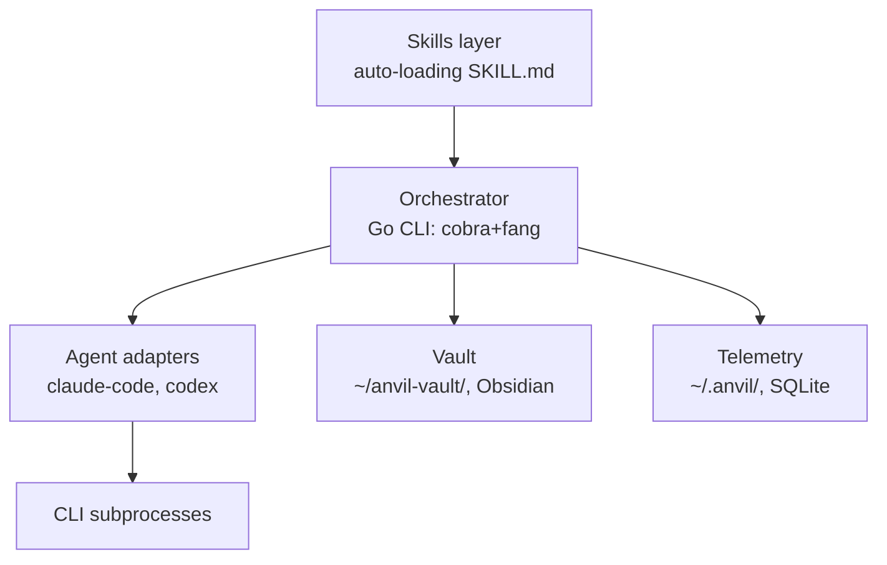
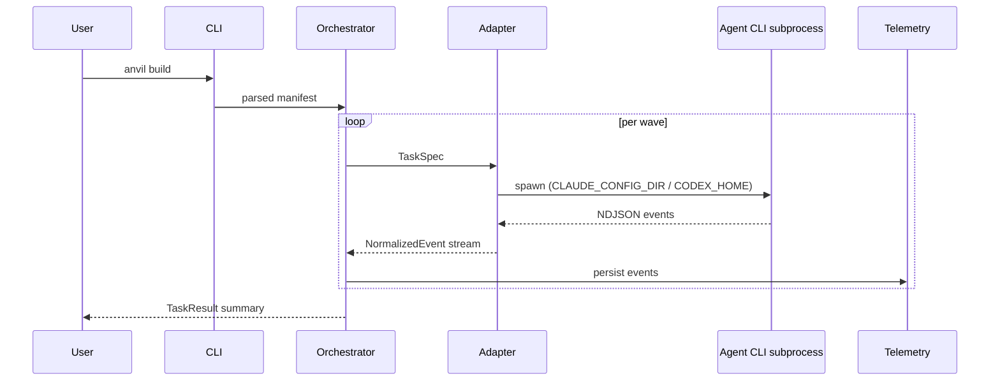
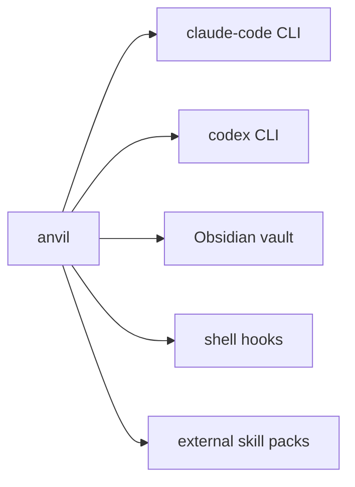

This is the live system-design reference. Long-form rationale and history live in [`design.md`](design.md) (legacy, do not edit). Product vision lives in [`product-design.md`](product-design.md). Skill authoring rules live in [`skill-authoring.md`](skill-authoring.md). Vault artifact schemas live in [`vault-schemas.md`](vault-schemas.md).

## Read when:

- **[Repository structure](system-design/repo-structure.md)** — laying out files/dirs in the source tree or `~/.anvil/`.
- **[Knowledge base](system-design/knowledge-base.md)** — vault-touching work, frontmatter, workflow-stage mapping.
- **[CLI substrate](system-design/cli-substrate.md)** — CLI verb work (`create`, `link`, `set`, etc.).
- **[Agent adapters](system-design/adapters.md)** — agent-adapter work: implementing or modifying claude-code / codex integrations. Covers the AgentAdapter contract, subprocess streaming gotchas, and failure handling.
- **[Telemetry](system-design/telemetry.md)** — telemetry, cost capture, SQLite event store.
- **[Skill-based execution](system-design/skill-execution.md)** — skill registry, auto-discovery, CI-vs-orchestrator split.

## Architectural overview

Three layers. The **skills layer** is a flat directory of SKILL.md files that auto-load into agent subprocesses; it carries the methodology and is the primary surface users author against. The **orchestrator** is a thin Go CLI built on cobra+fang that parses manifests, walks the wave graph, spawns agent CLI subprocesses through adapters, and persists telemetry. The **vault** is an Obsidian tree at `~/anvil-vault/` holding product designs, system designs, decisions, milestones, and user-authored knowledge skills; operational state (in-flight runs, telemetry DB, per-spawn state dirs) lives separately under `~/.anvil/`.

The orchestrator is deliberately small. Coding work happens inside agent CLI subprocesses, which preserves subscription billing and inherits each agent's tool harness. Anvil's job is sequencing, isolation, and capture — not reimplementing what the agents already do.

**Guides and sensors.** The harness has two halves. *Guides* are feedforward — skills, CLAUDE.md/AGENTS.md, the design-driven artifact hierarchy, vault context — they shape the agent's output before it acts. *Sensors* are feedback — CI checks against `skills/`, schema validation on vault artifacts, the educational gate, telemetry-driven cost surfacing — they observe and correct after the agent acts. v0.1 is guide-dominant; deterministic sensors beyond the listed few are a deliberate gap, not an oversight (see [§ Risks](#risks)).

**Computational vs. inferential controls.** Within both halves, controls split by execution kind. *Computational* controls are deterministic and cheap (linters, schema validators, hooks, structural tests) — these belong in CI and the orchestrator. *Inferential* controls are LLM-mediated (skills, gates, review passes) — these belong in skills and run inside the agent subprocess. The split is a placement rule: if a check can be made deterministic, it does not belong in a skill.

## Components and responsibilities

**CLI** (`internal/cli/`). Cobra root with fang for styling. Sub-commands: `build`, `init`, `status`, `cost`, `skill`. Parses flags, loads the project manifest, hands a parsed graph to the orchestrator core. No business logic; pure dispatch.

**Orchestrator core** (`internal/core/`). Wave executor walks the topological order of tasks; in v0.1, sequentially. Manifest loader parses the project's plan into a wave graph. Skill registry scans `skills/` at startup and produces the list compiled into each spawn's state dir. No registry file — discovery is by file presence (invariant).

**Agent adapters** (`internal/adapters/`). One package per agent. Each implements the `AgentAdapter` interface defined in [AgentAdapter contract](system-design/adapters.md). v0.1 ships `claude-code`; `codex` arrives in v0.2. Adapters spawn the CLI subprocess with a per-spawn state-dir env var, parse NDJSON output line-by-line, and surface a `NormalizedEvent` channel.

**Telemetry** (`internal/telemetry/`). SQLite event store using `modernc.org/sqlite` (pure Go). Writes per-event rows during runs; aggregates for `anvil cost`. Local-only by invariant; no network egress.

**Installer** (`internal/installer/`). On `anvil init`, materializes embedded skills and CLAUDE.md/AGENTS.md templates into the project and (optionally) scaffolds `~/anvil-vault/`. On `anvil build`, populates each spawn's state dir with the compiled skill set.

**Templates** (`internal/templates/`). Embedded `text/template` assets via `//go:embed`. Used by the installer; no runtime fetching.

**Skills layer** (`skills/`). Flat tree of SKILL.md files. Auto-loaded by file presence — no manifest, no registry. Authoring rules in [`skill-authoring.md`](skill-authoring.md).

**Vault** (`~/anvil-vault/`). Obsidian tree of authored knowledge. Schemas (frontmatter shape per artifact type) in [`vault-schemas.md`](vault-schemas.md). Lives outside any source repo by invariant.

## Data flow

`anvil build` is the load-bearing path. The CLI parses the manifest into a wave graph and hands it to the orchestrator. For each wave (sequential in v0.1), the orchestrator constructs a `TaskSpec`, calls the appropriate adapter, and consumes a `NormalizedEvent` stream while the adapter drives the subprocess. Events are persisted to telemetry as they arrive. On wave completion the orchestrator emits a `TaskResult` summary; on failure the wave pauses and the user is prompted (see [Failure handling](system-design/adapters.md#failure-handling)).

## Boundaries and integration points

**claude-code CLI.** Subprocess boundary. Anvil spawns `claude` with `CLAUDE_CONFIG_DIR` set per-spawn, parses stream-json NDJSON, and seeds credentials by symlinking `~/.claude/.credentials.json` into the per-spawn state dir.

**codex CLI** (v0.2). Same shape: `CODEX_HOME` per-spawn, `auth.json` copied in (Codex refreshes in place).

**Obsidian vault.** Filesystem-only. Anvil reads and writes Markdown under `~/anvil-vault/`; Obsidian's plugin layer (Bases, Dataview) is not a dependency, only a viewer.

**Shell hooks.** `anvil hook install` writes lifecycle hooks (pre-build, post-build) the user's shell or git config invokes. Hooks are scripts, not RPC; no daemon.

**External skill packs.** Packs like Superpowers are installed into `skills/` via `anvil skill pack enable`. They're regular SKILL.md files after installation; no runtime coupling.

## Risks

- Agent CLI tool-result line exceeding 8 MiB → wave hangs. Mitigated by the load-bearing scanner buffer; signal is a stalled subprocess with no event flow.
- Companion-pack drift if Superpowers reshapes its core skills, breaking the compose-and-then-fork posture. Signal is library-smoke-test churn after a Superpowers release.
- Subscription auth shape change in claude-code or codex (credential file format, OAuth flow) requires coordinated adapter updates. Signal is `ErrorKind = Auth` rate spikes.
- Skill auto-loading by file presence: a malformed SKILL.md crashes the host CLI; anvil has no fallback because the host owns skill parsing. Signal is `claude` exiting non-zero before any anvil event lands.
- Sensor coverage is thin in v0.1. Beyond the CI checks against `skills/` and the educational gate, Anvil ships almost no deterministic post-action sensors (no architecture-fitness checks, no scheduled drift scans, no automated cleanup PRs). Mitigation is honest framing — guide-dominance is the v0.1 stance, not a permanent shape — and a v0.2+ slot for scheduled cleanup work.
- Harness coverage is unmeasured. Telemetry records what happened, but the loop from telemetry back into evolving skills is manual. We do not yet have a metric for "is the harness working" beyond skill auto-fire rate; this is the open question the product-design success metrics partially proxy for.

## AI engineering & token strategy

**The ≤5k always-on budget is the load-bearing constraint.** AGENTS.md/CLAUDE.md is the only per-turn cost. The vault itself is lazy-loaded.

**Skills are the lazy-loading unit** — fewer, denser skills beat many small ones (especially for OpenCode, which injects the full skill catalog into the system prompt without dedup).

**Subscription billing preserved** via subprocess invocation of CLIs (Claude Max, ChatGPT Plus). No SDK calls for heavy work; auxiliary text-only operations (classification, summarization, cost estimation) are the only API-direct path.

**Per-task attribution** via worktree/cwd is how subscription-billed observability tools (`ccusage`, etc.) group sessions.

**Fresh-session discipline + plan files on disk** is the dominant pattern for managing context rot — Anvil's wave executor commits to it (one fresh subprocess per task) and the vault's `80-plans/` keeps the canonical handoff durable.

**Always-on layer (`AGENTS.md`, ≤5k tokens):**

| Block | Budget | Contents |
|---|---|---|
| Vault map | ~400 | Folder tree + one-line purpose each. |
| Workflow primer | ~600 | Stage table, condensed. |
| Frontmatter contract | ~500 | Universal core + `type:` dispatch. |
| Tag taxonomy | ~300 | Four facets + "status doesn't go in tags". |
| Tool routing | ~400 | How to find/invoke skills; pointer to `40-skills/`. |
| Per-project context | ~1500 | Active milestone, current issue, design pointers. Generated by `anvil status`. |
| Reserved | ~1300 | Headroom. |

Per-project `AGENTS.md` lives in `~/.anvil/projects/<slug>/AGENTS.md` and concatenates with the vault-level file at session start. Vault-level is durable; project-level is generated.

## Companion packs framing

External in v0.1. Superpowers is the recommended companion pack and is offered (not forced) on `anvil init`. It supplies the generic engineering skills — debugging, brainstorming, TDD, refactoring — that Anvil deliberately doesn't ship. Anvil's bundled v0.1 skills cover only what's load-bearing for the methodology itself: meta-skills, design-side skills, and core lifecycle skills.

The longer arc is compose-and-then-fork-deliberately. As we accumulate experience using Superpowers' skills inside Anvil's lifecycle, specific skills will be ported into the bundle when tighter integration earns its keep (e.g., wanting `systematic-debugging` to auto-capture findings to the vault). The `forked_from` metadata convention lands in v0.3 to keep that provenance honest. Until then, external is the right default — packs evolve faster outside than they would as an Anvil monorepo.

## Why this shape

See `product-design.md` for product-side beliefs and `design.md` for the long version of the history. Direct rationale only here.

**Why Go.** Cold-start matters for a CLI users invoke dozens of times a day; Python's interpreter startup taxed every invocation. Single-binary distribution removes the install-Python-then-pip dance; `go install` and goreleaser-built tarballs cover every platform without runtime dependencies. The standard library covers what we need (subprocess management, JSON streaming, embedded assets, SQLite via pure-Go driver) without a heavyweight framework.

**Why a thin orchestrator.** The agent CLIs already have tool harnesses, file editors, permission models, and subscription billing relationships with their vendors. Reimplementing any of that would either bypass billing (breaking the invariant) or duplicate work that the agents do better. Spawning the user's installed CLI is the cheapest correct integration.

**Why mermaid in the design doc.** Plain text, diffable, renders natively in Obsidian and GitHub, survives plugin churn. PNGs go stale; mermaid moves with the prose.

**Why skills auto-load by file presence.** A manifest is a second source of truth. Manifests drift from the filesystem under multi-user editing and produce silent skill-missing failures. File-presence discovery has one source of truth and one failure mode: the file isn't there. The CI checks (body length, namespace handoff, etc.) catch the failure modes that *can* happen statically.

**Why sequential v0.1.** Per-spawn isolation works trivially without git worktree management, failure modes are simpler with one process to monitor, and the wave-graph machinery still earns its place by determining task order. Concurrent waves arrive in v0.2 with worktrees, a default cap of 4, and backoff — added with eyes open after the sequential path proves out.

**Why a fixed topology.** An LLM-based agent can produce almost anything; a harness designed against that full range is intractable. Anvil narrows the variety on purpose — one adapter contract, one artifact hierarchy (product-design → milestone → plan → issue), one skill-pack shape, one vault layout. Each commitment shrinks the surface the harness has to cover and makes guides and sensors composable. Skill packs are templates over this topology; companion packs slot into the same shape rather than introducing new ones. Product-side rationale lives in `product-design.md` § Why it matters; the operational consequence is that adding a new artifact type, adapter, or top-level vault tier is a topology change, not a feature.

**Why local-only telemetry.** The data is sensitive (prompts, tool calls, costs) and the user's machine is the only place it needs to live for `anvil cost` and `anvil status` to work. Network egress would add a privacy surface for no product benefit. If a user opts into export later, that's an explicit decision, not a default.
