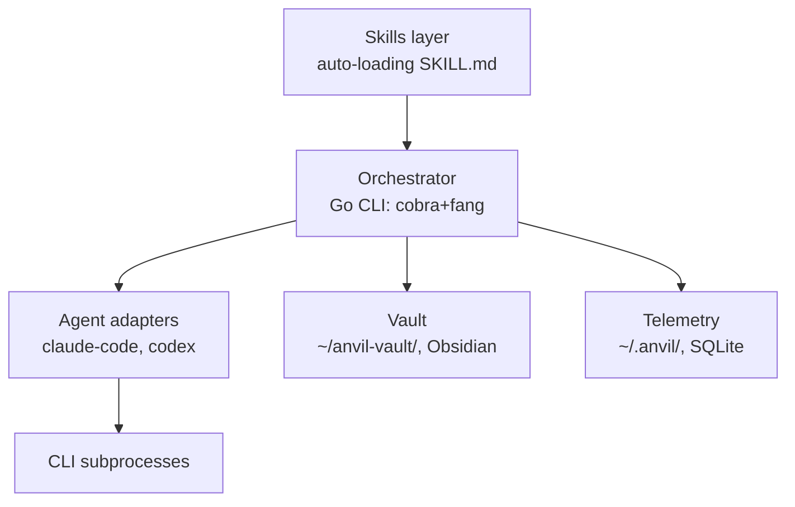
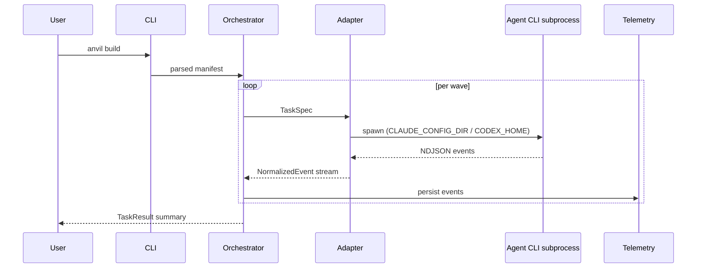
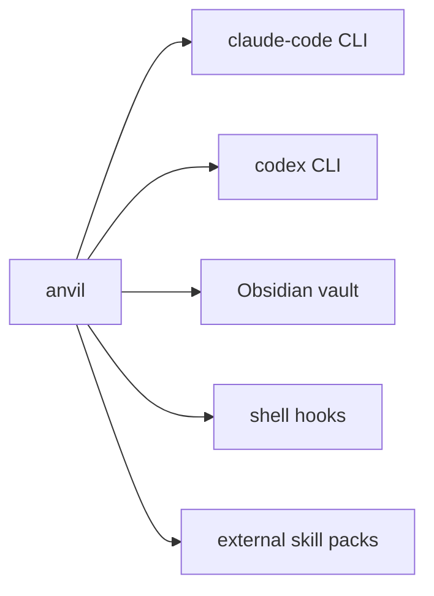
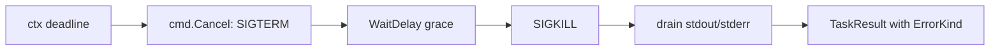

This is the live system-design reference. Long-form rationale and history live in [`design.md`](design.md) (legacy, do not edit). Product vision lives in [`product-design.md`](product-design.md). Skill authoring rules live in [`skill-authoring.md`](skill-authoring.md). Vault artifact schemas live in [`vault-schemas.md`](vault-schemas.md).

## Architectural overview



Three layers. The **skills layer** is a flat directory of SKILL.md files that auto-load into agent subprocesses; it carries the methodology and is the primary surface users author against. The **orchestrator** is a thin Go CLI built on cobra+fang that parses manifests, walks the wave graph, spawns agent CLI subprocesses through adapters, and persists telemetry. The **vault** is an Obsidian tree at `~/anvil-vault/` holding product designs, system designs, decisions, milestones, and user-authored knowledge skills; operational state (in-flight runs, telemetry DB, per-spawn state dirs) lives separately under `~/.anvil/`.

The orchestrator is deliberately small. Coding work happens inside agent CLI subprocesses, which preserves subscription billing and inherits each agent's tool harness. Anvil's job is sequencing, isolation, and capture — not reimplementing what the agents already do.

## Components and responsibilities

**CLI** (`internal/cli/`). Cobra root with fang for styling. Sub-commands: `build`, `init`, `status`, `cost`, `skill`. Parses flags, loads the project manifest, hands a parsed graph to the orchestrator core. No business logic; pure dispatch.

**Orchestrator core** (`internal/core/`). Wave executor walks the topological order of tasks; in v0.1, sequentially. Manifest loader parses the project's plan into a wave graph. Skill registry scans `skills/` at startup and produces the list compiled into each spawn's state dir. No registry file — discovery is by file presence (invariant).

**Agent adapters** (`internal/adapters/`). One package per agent. Each implements the `AgentAdapter` interface defined in [§ AgentAdapter contract](#agentadapter-contract). v0.1 ships `claude-code`; `codex` arrives in v0.2. Adapters spawn the CLI subprocess with a per-spawn state-dir env var, parse NDJSON output line-by-line, and surface a `NormalizedEvent` channel.

**Telemetry** (`internal/telemetry/`). SQLite event store using `modernc.org/sqlite` (pure Go). Writes per-event rows during runs; aggregates for `anvil cost`. Local-only by invariant; no network egress.

**Installer** (`internal/installer/`). On `anvil init`, materializes embedded skills and CLAUDE.md/AGENTS.md templates into the project and (optionally) scaffolds `~/anvil-vault/`. On `anvil build`, populates each spawn's state dir with the compiled skill set.

**Templates** (`internal/templates/`). Embedded `text/template` assets via `//go:embed`. Used by the installer; no runtime fetching.

**Skills layer** (`skills/`). Flat tree of SKILL.md files. Auto-loaded by file presence — no manifest, no registry. Authoring rules in [`skill-authoring.md`](skill-authoring.md).

**Vault** (`~/anvil-vault/`). Obsidian tree of authored knowledge. Schemas (frontmatter shape per artifact type) in [`vault-schemas.md`](vault-schemas.md). Lives outside any source repo by invariant.

## Data flow

`anvil build` is the load-bearing path. The CLI parses the manifest into a wave graph and hands it to the orchestrator. For each wave (sequential in v0.1), the orchestrator constructs a `TaskSpec`, calls the appropriate adapter, and consumes a `NormalizedEvent` stream while the adapter drives the subprocess. Events are persisted to telemetry as they arrive. On wave completion the orchestrator emits a `TaskResult` summary; on failure the wave pauses and the user is prompted (see [§ Failure handling](#failure-handling)).



## Boundaries and integration points



**claude-code CLI.** Subprocess boundary. Anvil spawns `claude` with `CLAUDE_CONFIG_DIR` set per-spawn, parses stream-json NDJSON, and seeds credentials by symlinking `~/.claude/.credentials.json` into the per-spawn state dir.

**codex CLI** (v0.2). Same shape: `CODEX_HOME` per-spawn, `auth.json` copied in (Codex refreshes in place).

**Obsidian vault.** Filesystem-only. Anvil reads and writes Markdown under `~/anvil-vault/`; Obsidian's plugin layer (Bases, Dataview) is not a dependency, only a viewer.

**Shell hooks.** `anvil hook install` writes lifecycle hooks (pre-build, post-build) the user's shell or git config invokes. Hooks are scripts, not RPC; no daemon.

**External skill packs.** Packs like Superpowers are installed into `skills/` via `anvil skill pack enable`. They're regular SKILL.md files after installation; no runtime coupling.

## Repository structure

Source repo:

```
anvil/                          # source repo
├── cmd/anvil/main.go
├── internal/
│   ├── cli/                    # cobra root + fang wrap
│   ├── core/                   # wave executor, manifest, skill registry
│   ├── adapters/               # AgentAdapter implementations
│   ├── telemetry/              # SQLite event store
│   ├── installer/              # skill + template install
│   └── templates/              # embedded text/template assets
├── skills/                     # auto-loaded SKILL.md
├── schemas/                    # JSON schemas (deferred)
├── docs/
├── go.mod
├── tool.go.mod                 # isolated tool deps (golangci-lint, goreleaser, govulncheck, gotestsum)
└── justfile
```

Operational state (per-machine, abbreviated; see `design.md` § Repository structure for the full layout including `build-runs/<run-id>/<task-id>/`):

```
~/.anvil/                       # operational state (per-machine)
├── projects/<project>/         # operational issues, in-progress work
├── state/                      # per-spawn CLAUDE_CONFIG_DIR / CODEX_HOME
└── telemetry.db                # SQLite
```

Knowledge vault (Obsidian; see `design.md` and `vault-schemas.md` for the long form):

```
~/anvil-vault/                  # knowledge vault (Obsidian)
├── 05-projects/<project>/      # product-design.md, system-design.md
├── 30-decisions/               # ADRs
├── 40-skills/                  # user-authored knowledge skills
└── 85-milestones/
```

The two trees are separate by invariant. Vault content is never committed to the project source repo; the source repo is never written into the vault.

`tool.go.mod` keeps developer-tool dependencies (linter, release tooling) isolated from the runtime module graph so `go install github.com/.../anvil/cmd/anvil@latest` stays clean.

## The `anvil` CLI (deterministic substrate)

The CLI is the **deterministic boundary** under the skills. Skills handle judgment; the CLI handles mechanics (paths, frontmatter generation, ID allocation, cross-references). This means: skills shrink, refactoring is safe, vault layout is invisible until needed.

Cold-start frequency is the load-bearing constraint — skills call the CLI dozens of times per session. Go's ~5–15ms cold start is effectively instant; Python's 80–200ms would disqualify it (10–20 seconds per session in pure overhead). Rust was considered (~3–10ms) but rejected for iteration friction. Go covers both the orchestrator and the CLI for this reason.

**Design rules:** boring, no interactive prompts, JSON output behind `--json`, stdout for content, stderr for diagnostics, meaningful exit codes, files stay editable by hand.

**Final v0.1 verb set** (uniform create/show/list/link/set over typed objects):

```
anvil where
anvil inbox      add | list | show | promote
anvil create     <type> [flags]              # type ∈ {issue, plan, milestone, decision, learning, sweep, thread}
anvil show       <type> <id>
anvil list       <type> [--filters]
anvil link       <type> <id> --to <type> <id>
anvil set        <type> <id> <field> <value>
anvil project    list | switch | adopt | current
```

`anvil session log` was cut as redundant — session transcripts are written by the agent CLIs themselves; the active plan file is the canonical handoff.

**Project identity resolution** (three-step fallback): git remote URL → explicit `anvil project adopt <slug>` binding (recorded in `~/.anvil/projects/<slug>/.binding`) → refuse with clear error. No magic cwd-basename fallback.

**Indexing strategy:** SQLite-backed structured index of frontmatter is the next step when scale demands it; embedded vector DB is unlikely to ever be necessary for this workload — structured queries handle 95% of what naive intuition would reach for vectors for.

The v0.0.0-dev scaffold has none of this wired (cobra+fang lands when the first verb is implemented); this section documents the planned surface, not what runs today.

## AgentAdapter contract

```go
// AgentAdapter is the contract every agent-CLI integration implements.
// Adapters spawn an external CLI subprocess (claude-code, codex), normalize
// its event stream, and surface a uniform result.
type AgentAdapter interface {
    Run(ctx context.Context, spec TaskSpec) (TaskResult, error)
    Events() <-chan NormalizedEvent

    // Capability flags — checked by orchestrator before scheduling.
    SupportsResume() bool
    SupportsParallelTools() bool
    SupportsThinking() bool
}

type TaskSpec struct {
    Prompt       string
    SystemPrompt string
    WorkingDir   string
    EnvOverrides map[string]string  // CLAUDE_CONFIG_DIR, CODEX_HOME — set per spawn
    Timeout      time.Duration
}

type TaskResult struct {
    ExitCode  int
    Stdout    string
    Stderr    string
    Cost      CostBreakdown
    Duration  time.Duration
    ErrorKind ErrorKind  // none | timeout | crash | permission | quota | auth
}

type NormalizedEvent struct {
    Kind      EventKind  // ToolUse, ToolResult, Message, Error, Done
    Timestamp time.Time
    Payload   any
}
```

**Per-spawn isolation is invariant.** `EnvOverrides` is the channel through which `CLAUDE_CONFIG_DIR` (or `CODEX_HOME`) reaches the subprocess; the orchestrator allocates a fresh state dir per task and seeds credentials before `Run` is called. Adapters never share state across calls — concurrent calls in v0.2 will be safe by construction because each call has its own dir.

**Why `<-chan NormalizedEvent` instead of a callback.** Channels compose naturally with `context.Context`, support fan-in for v0.2 concurrent waves, and let the orchestrator apply backpressure by simply not reading. A callback would invert control and make cancellation harder to reason about.

**Why `context.Context` and not a custom cancellation type.** It's the Go-standard mechanism. `exec.CommandContext` integrates directly: setting `cmd.Cancel` to send SIGTERM and `cmd.WaitDelay` to escalate to SIGKILL gives graceful-then-forceful kill without writing process-management code by hand. Timeouts compose via `context.WithTimeout`.

## Subprocess streaming gotchas

Two v0.1 footguns worth surfacing inline because both bite quickly and silently.

**`bufio.Scanner` line limit.** Default `MaxScanTokenSize` is 64 KiB. Claude Code and Codex routinely emit `tool_result` lines exceeding this (large file reads, big shell outputs). The scanner returns `bufio.ErrTooLong` and silently drops events. Fix:

```go
scanner.Buffer(make([]byte, 0, 64*1024), 8*1024*1024)  // 8 MiB max line
```

8 MiB is well above observed real-world maxima. For genuinely unbounded input, use `bufio.Reader.ReadBytes('\n')` instead.

**Per-spawn state isolation.** Repeating because it's load-bearing: `CLAUDE_CONFIG_DIR` (Claude) and `CODEX_HOME` (Codex) must be set to a fresh per-spawn directory, with credentials seeded in before spawn. Sharing state across spawns corrupts both CLIs (Claude #24864/#17531; Codex #11435/#1991). The orchestrator allocates the dir; the adapter sets the env var via `TaskSpec.EnvOverrides`; cleanup happens after `Run` returns.

## Telemetry

SQLite via `modernc.org/sqlite` — pure Go, no cgo. Rationale: cross-compiles cleanly to every release target, keeps `go install ...@latest` working without a C toolchain, and matches the single-binary distribution invariant. `mattn/go-sqlite3` is rejected on cgo grounds despite being faster; v0.1 telemetry volumes are tiny and the perf delta doesn't pay for the build complexity.

Adapter normalizers map per-CLI lines to `NormalizedEvent`. Sketches (signatures only):

```go
func normalizeClaude(line []byte) (NormalizedEvent, error) {
    // parse Claude Code NDJSON stream-json line into NormalizedEvent;
    // dedupe usage by assistant.message.id (multiple tool_use blocks share one).
    return NormalizedEvent{}, nil
}

func normalizeCodex(line []byte) (NormalizedEvent, error) {
    // parse Codex JSONL event line; treat `error` events matching ^Reconnecting
    // as Retry (non-terminal), only turn.failed / unprefixed error as Error.
    return NormalizedEvent{}, nil
}
```

Cost capture (sketch — full table in `design.md` § Telemetry collection):

| Field | Claude Code | Codex |
|---|---|---|
| `cost_usd` | terminal `result.total_cost_usd` (estimate on Max subscriptions) | not exposed via `exec`; quota only |
| `tokens` | last `result.usage` (deduped) | last `turn.completed.usage` |
| `api_key_source` | `system.init.apiKeySource` | n/a |

For Max users the cost is an estimate of API-equivalent rates, not actual billing. `anvil cost` surfaces that distinction honestly.

## Failure handling

Every `Run` runs under a `context.WithTimeout`. The adapter sets `cmd.Cancel` (sends SIGTERM on context cancellation) and `cmd.WaitDelay` (escalates to SIGKILL after a grace period). When the context expires, the subprocess is killed wall-clock; partial output is drained; a `TaskResult` is constructed with the appropriate `ErrorKind`.



| Failure mode | Detection | Recovery |
|---|---|---|
| Hung subprocess (no output) | `ctx.Done()` after `Timeout` | wall-clock SIGKILL via `cmd.Cancel`+`WaitDelay`; `ErrorKind = Timeout` |
| Crash mid-run | non-zero exit; no `Done` event | capture stderr; `ErrorKind = Crash` |
| Permission blocked | adapter event with `permission_denials` | `ErrorKind = Permission`; surface what was denied |
| Quota / billing exhausted | adapter `error` event matching billing/rate_limit | `ErrorKind = Quota`; pause wave, surface cost message |
| Auth lost | adapter event or HTTP 401 | `ErrorKind = Auth`; prompt re-login |

When a task fails the wave pauses. The orchestrator surfaces the failure (which task, which `ErrorKind`, last assistant text) and asks the user: retry, fall back to inline implementation, or abort the build. Subsequent waves don't start until the user resolves.

## Skill management

Authoring rules — body length, ALL-CAPS triggers, namespace handoff, description budget, `# prettier-ignore` directive — live in [`skill-authoring.md`](skill-authoring.md). This section captures only how the orchestrator consumes skills.

**Auto-discovery.** On `anvil build`, the installer walks `skills/` and copies every SKILL.md into the spawn's state dir (`<state>/skills/<name>/SKILL.md`). The agent CLI's native skill loader picks them up by file presence. No manifest, no registry file (per invariant) — adding a SKILL.md to `skills/` is the only step needed to ship a new skill.

**CI vs. orchestrator.** Body length, ALL-CAPS, namespace-handoff, negative-trigger, and aggregate description-budget checks run in CI against `skills/`. The orchestrator assumes its inputs are valid SKILL.md files and does not re-validate at runtime — validation that fires at spawn time is too late.

**Source registry.** v0.1 scans only the project's `skills/` directory. v0.2 adds the vault's `40-skills/` and external pack directories under `~/.anvil/packs/`.

## Risks

- Agent CLI tool-result line exceeding 8 MiB → wave hangs. Mitigated by the load-bearing scanner buffer; signal is a stalled subprocess with no event flow.
- Companion-pack drift if Superpowers reshapes its core skills, breaking the compose-and-then-fork posture. Signal is library-smoke-test churn after a Superpowers release.
- Subscription auth shape change in claude-code or codex (credential file format, OAuth flow) requires coordinated adapter updates. Signal is `ErrorKind = Auth` rate spikes.
- Skill auto-loading by file presence: a malformed SKILL.md crashes the host CLI; anvil has no fallback because the host owns skill parsing. Signal is `claude` exiting non-zero before any anvil event lands.

## Companion packs framing

External in v0.1. Superpowers is the recommended companion pack and is offered (not forced) on `anvil init`. It supplies the generic engineering skills — debugging, brainstorming, TDD, refactoring — that Anvil deliberately doesn't ship. Anvil's bundled v0.1 skills cover only what's load-bearing for the methodology itself: meta-skills, design-side skills, and core lifecycle skills.

The longer arc is compose-and-then-fork-deliberately. As we accumulate experience using Superpowers' skills inside Anvil's lifecycle, specific skills will be ported into the bundle when tighter integration earns its keep (e.g., wanting `systematic-debugging` to auto-capture findings to the vault). The `forked_from` metadata convention lands in v0.3 to keep that provenance honest. Until then, external is the right default — packs evolve faster outside than they would as an Anvil monorepo.

## Why this shape

See `product-design.md` for product-side beliefs and `design.md` for the long version of the history. Direct rationale only here.

**Why Go.** Cold-start matters for a CLI users invoke dozens of times a day; Python's interpreter startup taxed every invocation. Single-binary distribution removes the install-Python-then-pip dance; `go install` and goreleaser-built tarballs cover every platform without runtime dependencies. The standard library covers what we need (subprocess management, JSON streaming, embedded assets, SQLite via pure-Go driver) without a heavyweight framework.

**Why a thin orchestrator.** The agent CLIs already have tool harnesses, file editors, permission models, and subscription billing relationships with their vendors. Reimplementing any of that would either bypass billing (breaking the invariant) or duplicate work that the agents do better. Spawning the user's installed CLI is the cheapest correct integration.

**Why mermaid in the design doc.** Plain text, diffable, renders natively in Obsidian and GitHub, survives plugin churn. PNGs go stale; mermaid moves with the prose.

**Why skills auto-load by file presence.** A manifest is a second source of truth. Manifests drift from the filesystem under multi-user editing and produce silent skill-missing failures. File-presence discovery has one source of truth and one failure mode: the file isn't there. The CI checks (body length, prettier-ignore, etc.) catch the failure modes that *can* happen statically.

**Why sequential v0.1.** Per-spawn isolation works trivially without git worktree management, failure modes are simpler with one process to monitor, and the wave-graph machinery still earns its place by determining task order. Concurrent waves arrive in v0.2 with worktrees, a default cap of 4, and backoff — added with eyes open after the sequential path proves out.

**Why local-only telemetry.** The data is sensitive (prompts, tool calls, costs) and the user's machine is the only place it needs to live for `anvil cost` and `anvil status` to work. Network egress would add a privacy surface for no product benefit. If a user opts into export later, that's an explicit decision, not a default.
