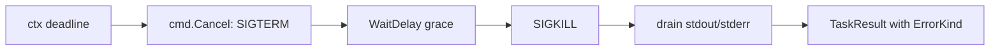

## AgentAdapter contract

```go
// AgentAdapter is the contract every agent-CLI integration implements.
// Adapters spawn an external CLI subprocess (claude-code, codex), normalize
// its event stream, and surface a uniform result.
type AgentAdapter interface {
    Run(ctx context.Context, spec TaskSpec) (TaskResult, error)
    Events() <-chan NormalizedEvent

    // Capability flags — checked by orchestrator before scheduling.
    SupportsResume() bool
    SupportsParallelTools() bool
    SupportsThinking() bool
}

type TaskSpec struct {
    Prompt       string
    SystemPrompt string
    WorkingDir   string
    EnvOverrides map[string]string  // CLAUDE_CONFIG_DIR, CODEX_HOME — set per spawn
    Timeout      time.Duration
}

type TaskResult struct {
    ExitCode  int
    Stdout    string
    Stderr    string
    Cost      CostBreakdown
    Duration  time.Duration
    ErrorKind ErrorKind  // none | timeout | crash | permission | quota | auth
}

type NormalizedEvent struct {
    Kind      EventKind  // ToolUse, ToolResult, Message, Error, Done
    Timestamp time.Time
    Payload   any
}
```

**Per-spawn isolation is invariant.** `EnvOverrides` is the channel through which `CLAUDE_CONFIG_DIR` (or `CODEX_HOME`) reaches the subprocess; the orchestrator allocates a fresh state dir per task and seeds credentials before `Run` is called. Adapters never share state across calls — concurrent calls in v0.2 will be safe by construction because each call has its own dir.

**Why `<-chan NormalizedEvent` instead of a callback.** Channels compose naturally with `context.Context`, support fan-in for v0.2 concurrent waves, and let the orchestrator apply backpressure by simply not reading. A callback would invert control and make cancellation harder to reason about.

**Why `context.Context` and not a custom cancellation type.** It's the Go-standard mechanism. `exec.CommandContext` integrates directly: setting `cmd.Cancel` to send SIGTERM and `cmd.WaitDelay` to escalate to SIGKILL gives graceful-then-forceful kill without writing process-management code by hand. Timeouts compose via `context.WithTimeout`.

## Subprocess streaming gotchas

Two v0.1 footguns worth surfacing inline because both bite quickly and silently.

**`bufio.Scanner` line limit.** Default `MaxScanTokenSize` is 64 KiB. Claude Code and Codex routinely emit `tool_result` lines exceeding this (large file reads, big shell outputs). The scanner returns `bufio.ErrTooLong` and silently drops events. Fix:

```go
scanner.Buffer(make([]byte, 0, 64*1024), 8*1024*1024)  // 8 MiB max line
```

8 MiB is well above observed real-world maxima. For genuinely unbounded input, use `bufio.Reader.ReadBytes('\n')` instead.

**Per-spawn state isolation.** Repeating because it's load-bearing: `CLAUDE_CONFIG_DIR` (Claude) and `CODEX_HOME` (Codex) must be set to a fresh per-spawn directory, with credentials seeded in before spawn. Sharing state across spawns corrupts both CLIs (Claude #24864/#17531; Codex #11435/#1991). The orchestrator allocates the dir; the adapter sets the env var via `TaskSpec.EnvOverrides`; cleanup happens after `Run` returns.

## Failure handling

Every `Run` runs under a `context.WithTimeout`. The adapter sets `cmd.Cancel` (sends SIGTERM on context cancellation) and `cmd.WaitDelay` (escalates to SIGKILL after a grace period). When the context expires, the subprocess is killed wall-clock; partial output is drained; a `TaskResult` is constructed with the appropriate `ErrorKind`.



| Failure mode | Detection | Recovery |
|---|---|---|
| Hung subprocess (no output) | `ctx.Done()` after `Timeout` | wall-clock SIGKILL via `cmd.Cancel`+`WaitDelay`; `ErrorKind = Timeout` |
| Crash mid-run | non-zero exit; no `Done` event | capture stderr; `ErrorKind = Crash` |
| Permission blocked | adapter event with `permission_denials` | `ErrorKind = Permission`; surface what was denied |
| Quota / billing exhausted | adapter `error` event matching billing/rate_limit | `ErrorKind = Quota`; pause wave, surface cost message |
| Auth lost | adapter event or HTTP 401 | `ErrorKind = Auth`; prompt re-login |

When a task fails the wave pauses. The orchestrator surfaces the failure (which task, which `ErrorKind`, last assistant text) and asks the user: retry, fall back to inline implementation, or abort the build. Subsequent waves don't start until the user resolves.
