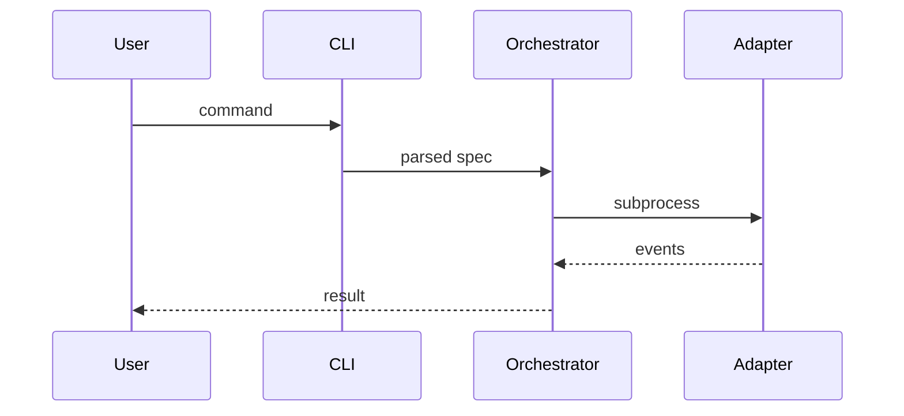
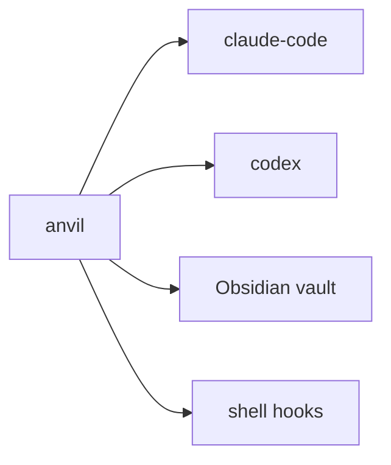

# Writing System Design

A workflow for authoring a project's system-design artifact — the architectural counterpart to `product-design`. The product design says *what* we're building and *why*; the system design says *what shape* it has, *what's load-bearing*, and *what must always be true*. Both are vault-only.

## When to use

- A `product-design` exists and the project needs an architectural shape before milestones, plans, or code.
- User says "let's system-design X", "what's the architecture", or anything that signals shape (not vision, not implementation tasks).
- Bootstrapping the second artifact in the vault hierarchy.

## When not to use

- No product-design yet → `anvil:writing-product-design` first.
- Vision, users, scope → `anvil:writing-product-design`.
- One milestone in detail → `anvil:defining-milestone`.
- Implementation tasks → `anvil:creating-issue` or `anvil:planning`.
- Documenting a *single* architectural choice (e.g., "JWT vs sessions") → that's an ADR, use `anvil:decision-making`.

## Output path

Canonical destination: `~/anvil-vault/05-projects/{project}/system-design.md`. Vault-only — never committed to the project's source repo. Schema lives in [vault-schemas.md](../../docs/vault-schemas.md) under the `system-design` section.

Surface this path at Phase 1 so the user can flag any constraint up front.

## The phases

Each phase has an explicit user gate. Don't skip the gates. Phases 1, 4, and 7 are load-bearing — Phase 1 enforces the product-design dependency, Phase 4 derives components from product-design milestones, Phase 7 produces the invariants that downstream planning and review check against.

### Phase 1 — Frame (LOAD-BEARING)

Confirm scope and dependency:
- What's the project? Confirm slug from existing product-design.
- Read the product-design at `~/anvil-vault/05-projects/{slug}/product-design.md`. **If it doesn't exist, stop.** Hand off to `anvil:writing-product-design`.
- Confirm destination path: `~/anvil-vault/05-projects/{slug}/system-design.md`.

**Gate (load-bearing):** product-design exists and is read. Without it, Phase 4 has nothing to derive components from.

### Phase 2 — Architectural overview

One sentence: the *shape* in the broadest terms ("X is a three-layer system: skills, orchestrator, vault.").

Draft body for "Architectural overview" — 1–3 paragraphs, leading with the shape, then naming each layer or major component without describing it.

**Gate:** user confirms the shape is right at this altitude.

### Phase 3 — Tech stack

Draft the **Tech stack** body section: a definition list (language, framework/CLI framework, database/storage, deployment, tests) capturing the locked-in choices. Body prose, not frontmatter — schema is `additionalProperties: false`.

**REQUIRED SUB-SKILL:** Use `anvil:decision-making` for any tech-stack choice that isn't already authorized by an ADR. Each choice should reference its ADR wikilink inline (the structural link goes in `authorized_by` per Phase 8).

**Gate:** user confirms each value, or marks it `TODO: decide via ADR`.

### Phase 4 — Components & responsibilities (LOAD-BEARING)

For each milestone in the product-design, identify which component delivers it. The mapping doesn't need to be 1:1 — one component may serve multiple milestones; one milestone may span multiple components.

Output:
- 3–8 components (more is a smell; fold related responsibilities).
- Per component: name, one-line responsibility, which milestones it serves.

Draft "Components and responsibilities" body section.

**Gate (load-bearing):** every milestone in the product-design maps to at least one component. Orphan milestones are a red flag — either the milestone is mis-shaped, or the component list is incomplete.

### Phase 5 — Data flow

Draft "Data flow" body section with a **mermaid sequence diagram** for the critical path (e.g., `anvil build` end-to-end, or the request lifecycle). Diagrams are deliverable content, not decoration.

(Replace with the project's actual flow — do not ship the placeholder.)

**Gate:** user confirms the diagram captures the critical path.

### Phase 6 — Boundaries & integration points

Draft "Boundaries and integration points" body section with a **mermaid context diagram** (boxes + arrows for external systems). Capture every system the project talks to: external CLIs, databases, message buses, file system locations, hooks, etc.

(Replace with the project's actual boundaries.)

**Gate:** user confirms no boundary is missing. Missing a boundary here means the system surprises someone in operation.

### Phase 7 — Key invariants (LOAD-BEARING)

Draft the **Key invariants** body section: 3–7 statements that must always be true about the system. These are the most-cited downstream content: planning checks against them; review verifies them. Body prose, not frontmatter.

Examples (from anvil itself):
- "Each agent CLI subprocess gets an isolated `CLAUDE_CONFIG_DIR` / `CODEX_HOME`."
- "Skills auto-load by file presence; no registry, no manifest."
- "Telemetry is local-only; nothing leaves the user's machine without explicit opt-in."

**Voice check.** Invariants are declarative and absolute. "We try to..." is not an invariant. "X is always true" is.

**Gate (load-bearing):** user signs off explicitly. Each invariant should make the user feel "yes, if that broke, the system would break." If the user shrugs, the invariant isn't load-bearing — strip it.

### Phase 8 — Authorized decisions

Populate the frontmatter `authorized_by` array — wikilinks to ADRs that authorized the choices captured above. Each tech-stack decision and each load-bearing invariant should ideally trace to a `[[decision.{project}.NNNN-{slug}]]`.

For v0.1 it's acceptable to have unresolved wikilinks — flag them as `TODO: capture as ADR via anvil:decision-making`.

**Gate:** list confirmed, or TODO list accepted.

### Phase 9 — Why this shape

Draft the **Why this shape** body section. ≤80 lines of rationale. Reference `product-design.md` for product-side beliefs and the ADRs in `authorized_by` for the architectural reasoning. Don't restate; cross-reference.

**Voice check (critical).** This section is where AI-generic prose creeps in. Audit for hedging, abstract framing, and corporate-speak. Direct, declarative, specific. Cite the user's own words from the product-design where possible.

**Gate:** user reads cold; voice matches the project's voice.

### Phase 10 — Risks

Draft the **Risks** body section. Architectural altitude: load-bearing assumptions that could fail, integration boundaries that could break, performance cliffs, security exposures.

3–7 bullets. Each names *what could go wrong* and (if possible) *what would signal it*.

**Gate:** list confirmed.

### Phase 11 — Serialize & save

1. Flip frontmatter `status: draft` → `active`. Bump `updated` to today.
2. Hand-check against `schemas/system-design.schema.json`:
   - Required frontmatter: `type, title, description, created, status, project`.
   - Optional frontmatter: `updated, tags, aliases, product_design, authorized_by, related`.
   - **No other frontmatter fields** — schema is `additionalProperties: false`. Tech-stack, invariants, risks, revisions are body sections.
   - Body has these sections in order: Architectural overview / Tech stack / Components and responsibilities / Data flow / Boundaries and integration points / Key invariants / Why this shape / Risks.
   - Mermaid diagrams in Data flow and Boundaries render (paste-test in Obsidian).
   - Wikilinks under `authorized_by` are well-formed `[[decision.{project}.NNNN-{slug}]]` (unresolved is OK; malformed is a bug).
3. Run `anvil validate <path>` — must pass clean.
4. Write to `~/anvil-vault/05-projects/{project}/system-design.md`.

**Gate:** user reads the artifact cold. Does it capture the system's shape? If anything's off, fix and re-show.

## Quick reference

| Phase | What | Gate |
|---|---|---|
| 1 Frame | Slug, product-design dependency, path | **Load-bearing** |
| 2 Architectural overview | One-sentence shape + body | User confirms |
| 3 Tech stack | `tech_stack` frontmatter | User confirms |
| 4 Components & responsibilities | 3–8 components, milestone mapping | **Load-bearing** |
| 5 Data flow | Mermaid sequence diagram + body | User confirms |
| 6 Boundaries | Mermaid context diagram + body | User confirms |
| 7 Key invariants | 3–7 declarative absolutes | **Load-bearing** |
| 8 Authorized decisions | ADR wikilinks (or TODOs) | User confirms |
| 9 Why this shape | Rationale (≤80 lines) | User reads cold |
| 10 Risks | 3–7 bullets | User confirms |
| 11 Serialize & save | Frontmatter, hand-check, write | User reads cold |

## Common mistakes

- **Skipping Phase 1's product-design check.** Without the product design, Phase 4 has no anchor and components drift toward implementation taste rather than product fit. Stop and hand off.
- **Soft invariants in Phase 7.** "We try to..." is not an invariant. If the user shrugs at a candidate, strip it.
- **Tech stack without ADRs.** Phase 3 should hand off to `anvil:decision-making` for any non-trivial choice. ADR-less tech stacks rot first.
- **Mermaid as decoration.** Phases 5 and 6 require diagrams as core content. A system design without a context diagram is incomplete.
- **AI-generic Why-this-shape prose.** Cite the user's own words; reference the product-design and ADRs; don't generate filler.
- **Conflating system design with planning.** Components are responsibilities, not work items. If a section reads like a task list, it belongs in `anvil:planning`.
